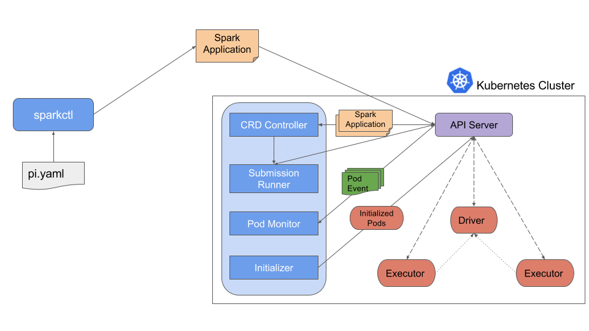

# Kubernetes Operator for Apache Spark Design

## Table of Contents
* [Introduction](#introduction)
* [Architecture](#architecture)
* [The CRD Controller](#the-crd-controller)
* [Handling Application Restart and Failures](#handling-application-restart-and-failures)
* [Mutating Admission Webhook](#mutating-admission-webhook)
* [Command-line Tool: Sparkctl](#command-line-tool-sparkctl)

## Introduction

In Spark 2.3, Kubernetes becomes an official scheduler backend for Spark, additionally to the standalone scheduler, Mesos, and Yarn. Compared with the alternative approach of deploying a standalone Spark cluster on top of Kubernetes and submit applications to run on the standalone cluster, having Kubernetes as a native scheduler backend offers some important benefits as discussed in [SPARK-18278](https://issues.apache.org/jira/browse/SPARK-18278) and is a huge leap forward. However, the way life cycle of Spark applications are managed, e.g., how applications get submitted to run on Kubernetes and how application status is tracked, are vastly different from that of other types of workloads on Kubernetes, e.g., Deployments, DaemonSets, and StatefulSets. The Kubernetes Operator for Apache Spark reduces the gap and allow Spark applications to be specified, run, and monitored idiomatically on Kubernetes.

Specifically, the Kubernetes Operator for Apache Spark follows the recent trend of leveraging the [operator](https://coreos.com/blog/introducing-operators.html) pattern for managing the life cycle of Spark applications on a Kubernetes cluster. The operator allows Spark applications to be specified in a declarative manner (e.g., in a YAML file) and run without the need to deal with the spark submission process. It also enables status of Spark applications to be tracked and presented idiomatically like other types of workloads on Kubernetes. This document discusses the design and architecture of the operator. For documentation of the [CustomResourceDefinition](https://kubernetes.io/docs/concepts/api-extension/custom-resources/) for specification of Spark applications, please refer to [API Definition](api-docs.md)      

## Architecture

The operator consists of:
* a `SparkApplication` controller that watches events of creation, updates, and deletion of 
`SparkApplication` objects and acts on the watch events,
* a *submission runner* that runs `spark-submit` for submissions received from the controller,
* a *Spark pod monitor* that watches for Spark pods and sends pod status updates to the controller,
* a [Mutating Admission Webhook](https://kubernetes.io/docs/reference/access-authn-authz/extensible-admission-controllers/) that handles customizations for Spark driver and executor pods based on the annotations on the pods added by the controller,
* and also a command-line tool named `sparkctl` for working with the operator. 

The following diagram shows how different components interact and work together.

Specifically, a user uses the `sparkctl` (or `kubectl`) to create a `SparkApplication` object. The `SparkApplication` controller receives the object through a watcher from the API server, creates a submission carrying the `spark-submit` arguments, and sends the submission to the *submission runner*. The submission runner submits the application to run and creates the driver pod of the application. Upon starting, the driver pod creates the executor pods. While the application is running, the *Spark pod monitor* watches the pods of the application and sends status updates of the pods back to the controller, which then updates the status of the application accordingly. 

## The CRD Controller

The `SparkApplication` controller, or CRD controller in short, watches events of creation, updates, and deletion of `SparkApplication` objects in any namespaces in a Kubernetes cluster, and acts on the watch events. When a new `SparkApplication` object is added (i.e., when the `AddFunc` callback function of the `ResourceEventHandlerFuncs` is called), it enqueues the object into an internal work queue, from which a worker picks it up prepares a submission and sends the submission to the submission runner, which actually submits the application to run in the Kubernetes cluster. The submission includes the list of arguments for the `spark-submit` command. The submission runner has a configurable number of workers for submitting applications to run in the cluster. When a `SparkApplication` object is deleted, the object is dequeued from the internal work queue and all the Kubernetes resources associated with the application get deleted or garbage collected.

When a `SparkApplication` object gets updated (i.e., when the `UpdateFunc` callback function of the `ResourceEventHandlerFuncs` is called), e.g., from the user who used `kubectl apply` to apply the update. The controller checks if the application specification in `SparkApplicationSpec` has changed. If the application specification remains the same, the controller simply ignores the update. This ensures that updates without application specification changes, e.g., those triggered by cache re-synchronization, won't result in application a re-submission. If otherwise the update was made to the application specification, the controller cancels the current run of the application by deleting the driver pod of the current run, and submits a new run of the application with the updated specification. Note that deleting the driver pod of the old run of the application effectively kills the run and causes the executor pods to be deleted as well because the driver is the owner of the executor pods. 

The controller is also responsible for updating the status of a `SparkApplication` object with the help of the Spark pod monitor, which watches Spark pods and update the `SparkApplicationStatus` field of corresponding `SparkApplication` objects based on the status of the pods. The Spark pod monitor watches events of creation, updates, and deletion of Spark pods, creates status update messages based on the status of the pods, and sends the messages to the controller to process. When the controller receives a status update message, it gets the corresponding `SparkApplication` object from the cache store and updates the the `Status` accordingly. 

As described in [API Definition](api-docs.md), the `Status` field (of type `SparkApplicationStatus`) records the overall state of the application as well as the state of each executor pod. Note that the overall state of an application is determined by the driver pod state, except when submission fails, in which case no driver pod gets launched. Particularly, the final application state is set to the termination state of the driver pod when applicable, i.e., `COMPLETED` if the driver pod completed or `FAILED` if the driver pod failed. If the driver pod gets deleted while running, the final application state is set to `FAILED`. If submission fails, the application state is set to `FAILED_SUBMISSION`.  There are two terminal states: `COMPLETED` and `FAILED` which means that any Application in these states will never be retried by the Operator. All other states are non-terminal and based on the State as well as RestartPolicy (discussed below) can be retried.

As part of preparing a submission for a newly created `SparkApplication` object, the controller parses the object and adds configuration options for adding certain annotations to the driver and executor pods of the application. The annotations are later used by the mutating admission webhook to configure the pods before they start to run. For example,if a Spark application needs a certain Kubernetes ConfigMap to be mounted into the driver and executor pods, the controller adds an annotation that specifies the name of the ConfigMap to mount. Later the mutating admission webhook sees the annotation on the pods and mount the ConfigMap to the pods.

## Handling Application Restart And Failures

The operator provides a configurable option through the `RestartPolicy` field of `SparkApplicationSpec` (see the [Configuring Automatic Application Restart and Failure Handling](user-guide.md#configuring-automatic-application-restart-and-failure-handling) for more details) for specifying the application restart policy. The operator determines if an application should be restarted based on its termination state and the restart policy. As discussed above, the termination state of an application is based on the termination state of the driver pod. So effectively the decision is based on the termination state of the driver pod and the restart policy. Specifically, one of the following conditions applies:

* If the restart policy type is `Never`, the application is not restarted upon terminating.
* If the restart policy type is `Always`, the application gets restarted regardless of the termination state of the application. Please note that such an Application will never end up in a terminal state of `COMPLETED` or `FAILED`.
* If the restart policy type  is `OnFailure`, the application gets restarted if and only if the application failed and the retry limit is not reached. Note that in case the driver pod gets deleted while running, the application is considered being failed as discussed above. In this case, the application gets restarted if the restart policy is `OnFailure`.

When the operator decides to restart an application, it cleans up the Kubernetes resources associated with the previous terminated run of the application and enqueues the `SparkApplication` object of the application into the internal work queue, from which it gets picked up by a worker who will handle the submission. Note that instead of restarting the driver pod, the operator simply re-submits the application and lets the submission client create a new driver pod.

## Mutating Admission Webhook

The operator comes with an optional mutating admission webhook for customizing Spark driver and executor pods based on certain annotations on the pods added by the CRD controller. The annotations are set by the operator based on the application specifications. All Spark pod customization needs except for those natively support by Spark on Kubernetes are handled by the mutating admission webhook.

## Command-line Tool: Sparkctl 

[sparkctl](../sparkctl/README.md) is a command-line tool for working with the operator. It supports creating a `SparkApplication`object from a YAML file, listing existing `SparkApplication` objects, checking status of a `SparkApplication`, forwarding from a local port to the remote port on which the Spark driver runs, and deleting a `SparkApplication` object. For more details on `sparkctl`, please refer to [README](../sparkctl/README.md). 
