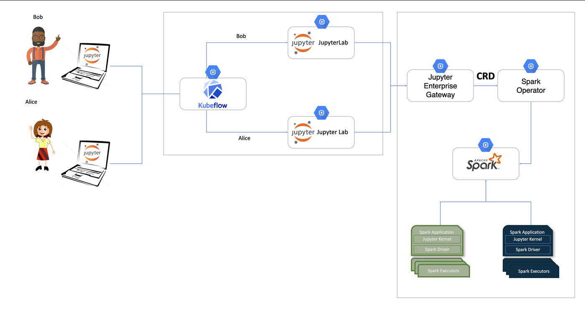

# Integration with Kubeflow Notebooks

If you're using Kubeflow Notebooks and want to run big data or distributed machine learning jobs with PySpark, the option is now available.

The Spark Operator streamlines the deployment of Apache Spark applications on Kubernetes. By integrating it with [Jupyter Enterprise Gateway](https://github.com/jupyter-server/enterprise_gateway) and Kubeflow Notebooks, users can now run PySpark workloads at scale directly from a kubeflow notebook interface, without worrying about the underlying Spark infrastructure.

This integration enables a seamless workflow for data scientists and ML engineers, allowing users to write PySpark code in their Kubeflow notebooks, which is then executed remotely using Kubernetes resources via the Spark Operator and Jupyter Enterprise Gateway.

## Architecture

The following diagram illustrates how the components work together:


---

## Overview

In a typical Kubeflow setup, users access Kubeflow Notebooks through the central dashboard. These notebooks can now be configured to run PySpark code remotely through kernels managed by Jupyter Enterprise Gateway.

Behind the scenes:

1. Jupyter Enterprise Gateway receives execution requests from Kubeflow notebooks.
2. Jupyter Enterprise Gateway creates and submits `SparkApplication` Custom Resources.
3. The Spark Operator handles the lifecycle of Spark driver and executor pods in Kubernetes.

This architecture enables scalable, elastic execution of big data or distributed ML workloads.

## Prerequisites

- A running Kubeflow deployment with Notebook Controller enabled
- Spark Operator installed and configured in the cluster
- Helm installed locally

---

## Step 1: Deploy Enterprise Gateway


We will start by deploying Jupyter Enterprise Gateway with support for remote kernel management.

Save the following manifest as `enterprise-gateway-helm.yaml` which will be used as the basic configuration for the gateway.

```yaml
global:
  rbac: true

image: elyra/enterprise-gateway:3.2.3
imagePullPolicy: Always
logLevel: DEBUG

kernel:
  shareGatewayNamespace: true
  launchTimeout: 300
  cullIdleTimeout: 3600
  allowedKernels:
    - spark_python_operator
    - python3
  defaultKernelName: spark_python_operator

kip:
  enabled: false
  image: elyra/kernel-image-puller:3.2.3
  imagePullPolicy: Always
  pullPolicy: Always
  defaultContainerRegistry: quay.io

```

Then deploy Enterprise Gateway using Helm:

The command below uses a YAML file named enterprise-gateway-helm.yaml, which includes an example configuration shown above.

```bash
helm upgrade --install enterprise-gateway \
  https://github.com/jupyter-server/enterprise_gateway/releases/download/v3.2.3/jupyter_enterprise_gateway_helm-3.2.3.tar.gz \
  --namespace enterprise-gateway \
  --values enterprise-gateway-helm.yaml \
  --create-namespace \
  --wait

```

## Step 2: Configure the Notebook to connect to the Jupyter Gateway

Each user will have to edit their Kubeflow Notebook's custom resources to configure the following environment variables to allow notebook to connect to the deployed Jupyter gateway.
    
```yaml
env:
  - name: JUPYTER_GATEWAY_URL
    value: http://enterprise-gateway.enterprise-gateway:8888
  - name: JUPYTER_GATEWAY_REQUEST_TIMEOUT
    value: "120"
  - name: KERNEL_SERVICE_ACCOUNT_NAME
    value: "enterprise-gateway-sa"

```

You can do this from the Lens, or using the following kubectl command below.

The <NOTEBOOK_NAME> parameter is the name of the notebook created on the Kubeflow Notebook workspace.

```shell
kubectl patch notebook <NOTEBOOK_NAME> \
  -n kubeflow-user-example-com \
  --type='json' \
  -p='[
    {
      "op": "add",
      "path": "/spec/template/spec/containers/0/env",
      "value": [
        {
          "name": "JUPYTER_GATEWAY_URL",
          "value": "http://enterprise-gateway.enterprise-gateway:8888"
        },
        {
          "name": "JUPYTER_GATEWAY_REQUEST_TIMEOUT",
          "value": "120"
        },
        {
          "name": "KERNEL_SERVICE_ACCOUNT_NAME",
          "value": "enterprise-gateway-sa"
        }
      ]
    }
  ]'

```

These variables configure JupyterLab to forward kernel execution to Jupyter Enterprise Gateway, which then runs PySpark jobs via the Spark Operator.

## Additional Customization

If you want to customize your kernel configuration or the custom resource submitted to the Spark Operator, follow these steps:

First, set up the storage resources, save the manifest below as `enterprise-gateway-storage.yaml`.

```yaml
apiVersion: v1
kind: Namespace
metadata:
  name: enterprise-gateway
  labels:
    app: enterprise-gateway
---
apiVersion: v1
kind: PersistentVolume
metadata:
  name: pvc-kernelspecs
  labels:
    app: enterprise-gateway
spec:
  storageClassName: standard
  capacity:
    storage: 1Gi
  accessModes:
    - ReadWriteOnce
  hostPath:
    path: "/jupyter-gateway/kernelspecs"
---
apiVersion: v1
kind: PersistentVolumeClaim
metadata:
  name: pvc-kernelspecs
  namespace: enterprise-gateway
spec:
  storageClassName: standard
  accessModes: [ReadWriteOnce]
  resources:
    requests:
      storage: 1Gi
```

This will create a volume and expose the path `/jupyter-gateway/kernelspecs`.

Apply it (Run the following command to create the resources:):

```bash
kubectl apply -f enterprise-gateway-storage.yaml
```

Next, add the kernelspecs to the mounted volume at `/jupyter-gateway/kernelspecs`.

You can download and extract them with:
```bash
mkdir spark_python_operator && cd spark_python_operator && curl -sL https://github.com/jupyter-server/enterprise_gateway/releases/download/v3.2.3/jupyter_enterprise_gateway_kernelspecs_kubernetes-3.2.3.tar.gz | tar -xz --strip-components=1 "spark_python_operator/*" 
```
Once extracted, make any necessary customizations to the kernelspecs.

To learn more about kernelspecs customization visit [Jupyter Enterprise Gateway Documentation](https://jupyter-enterprise-gateway.readthedocs.io/en/latest/)

## What Happens Next

Once everything is set up:

- Launch a notebook from the Kubeflow UI
- Select the `pyspark` kernel
- Write and run PySpark code
