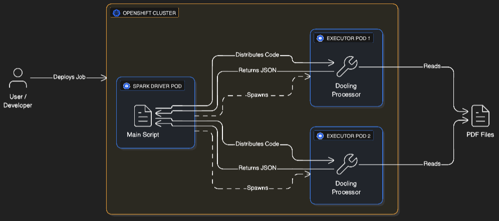

# Kubeflow Spark Operator on Red Hat AI

This documentation details how the Kubeflow Spark Operator works on Red Hat AI, its architecture, installation, and how to run a distributed Spark workload using the `docling-spark` application.

## 1. Spark Operator Architecture

The Spark Operator follows the standard Kubernetes Operator pattern:

1.  **CRD Controller**: Watches for events (Create, Update, Delete) on `SparkApplication` resources across configured namespaces.
2.  **Submission Runner**: When a `SparkApplication` is created, the operator generates the `spark-submit` command and executes it inside a simplified "submission" pod or internally.
3.  **Spark Pod Monitor**: Watches the status of the Driver and Executor pods and updates the `.status` field of the `SparkApplication` resource.
4.  **Mutating Admission Webhook**: An optional but recommended component that intercepts pod creation requests. It injects Spark-specific configuration (like mounting ConfigMaps or Volumes) into the Driver and Executor pods before they are scheduled.

### Flow on OpenShift

> **Note:** The Operator must be installed by a Cluster Admin before users can submit jobs.

1.  User applies `SparkApplication` YAML.
2.  Operator Controller (running in `kubeflow-spark-operator` namespace) detects the new resource.
3.  Operator creates a **Driver Pod** in the target namespace (e.g., `docling-spark`) via the OpenShift Cluster.
4.  Driver Pod starts and requests **Executor Pods** from the OpenShift Cluster.
5.  Executor Pods start, connect to the Driver, and process the tasks.



## 2. Installation on OpenShift

> **Pre-requisite:** This section requires **Cluster Admin** privileges. You must install the operator once so that users can submit `SparkApplication` CRDs.

Installing the Spark Operator on OpenShift requires Helm and configuring it to work with OpenShift's `restricted-v2` Security Context Constraints (SCC).

### Prerequisites
*   OpenShift CLI (`oc`) configured.
*   Helm CLI (`helm`)
*   Cluster Admin privileges
*   Docker (for building images).
*   Quay.io account (or any container registry).

### Installation Steps

### 1. Prepare the Cluster
```bash
# Log in to your Red Hat Openshift cluster
oc login

# Install Helm (if not already installed)
brew install helm

# Add the Spark Operator Helm repo
helm repo add spark-operator https://opendatahub-io.github.io/spark-operator
helm repo update
```

### 2. Prepare Values File

We need to override some default Helm values to ensure:
1.  **Security**: The operator is compatible with OpenShift's `restricted-v2` SCC (letting OpenShift assign User IDs automatically).
2.  **Functionality**: The operator watches the `docling-spark` namespace for SparkApplications.

Create a `spark-operator-values.yaml` file (or use the one in the repo):

```yaml
controller:
  podSecurityContext:
    fsGroup: null  

webhook:
  enable: true
  podSecurityContext:
    fsGroup: null  

spark:
  jobNamespaces:
    - docling-spark
```

> **Note:** The `spark.jobNamespaces` setting specifies which namespaces the operator watches for SparkApplications. If you leave the array empty (`jobNamespaces: []`), the operator will watch **all namespaces**. For better security isolation and control, always specify the namespaces where Spark jobs should run.

### 3. Install the Operator

```bash
# Create the namespace
oc new-project kubeflow-spark-operator

# Install via Helm
helm install spark-operator spark-operator/spark-operator \
    --namespace kubeflow-spark-operator \
    -f spark-operator-values.yaml \
    --version 2.2.1
```

> **Version Note:** We use v2.2.1 which includes Spark 3.5.5. Newer versions (v2.3.x+) ship with Spark 4.x which may have breaking changes. See the [version matrix](https://github.com/kubeflow/spark-operator?tab=readme-ov-file#version-matrix) for details.

### 4. Verify Installation and Security Context
After installation, verify the operator pods are running and, crucially, that the cluster is correctly enforcing the restricted-v2 security policy required for the custom image.
1. Check Pod Status
```bash
oc get pods -n kubeflow-spark-operator
```

You should see:
- `spark-operator-controller-*` (Running)
- `spark-operator-webhook-*` (Running)

2. Confirm Security Context Constraint (SCC)
Use the describe command to confirm that the restricted-v2 policy is assigned to the pods.
```oc describe pod <POD_NAME> -n kubeflow-spark-operator
```
Look for the following line in the Annotations section:
```Annotations: 
  openshift.io/scc: restricted-v2
```

3. Verify Arbitrary UID Injection (Acceptance Criteria)
To definitively prove that the container is running with a random non-root UID and is a member of the required Group 0, execute the id command inside the container. This confirms the environment is ready for the compatible Spark image.
```oc exec -n kubeflow-spark-operator <POD_NAME> -- id
```

## 3. SparkApplication CRD

The **SparkApplication** Custom Resource Definition (CRD) is the core abstraction provided by the operator. It allows you to define Spark applications declaratively using Kubernetes YAML manifests, similar to how you define Deployments or Pods.

Key fields in the `SparkApplication` spec include:

*   **`type`**: The language of the application (`Python`).
*   **`mode`**: Deployment mode (`cluster` or `client`). In `cluster` mode, the driver runs in a pod.
*   **`image`**: The container image to use for the driver and executors.
*   **`mainApplicationFile`**: The entry point path (e.g., `local:///app/scripts/run_spark_job.py`).
*   **`sparkVersion`**: The version of Spark to use (must match the image).
*   **`restartPolicy`**: Handling of failures (`Never`, `OnFailure`, `Always`).
*   **`driver` / `executor`**: Resource requests (cores, memory), labels, service accounts, and **security contexts**.

Example snippet from `k8s/docling-spark-app.yaml`:

```yaml
apiVersion: "sparkoperator.k8s.io/v1beta2"
kind: SparkApplication
metadata:
  name: docling-spark-job
  namespace: docling-spark
spec:
  type: Python
  mode: cluster
  image: quay.io/rishasin/docling-spark:latest
  imagePullPolicy: Always
  mainApplicationFile: local:///app/scripts/run_spark_job.py
  arguments:
    - "--input-dir"
    - "/app/assets"
    - "--output-file"
    - "/app/output/results.jsonl"
  sparkVersion: "3.5.0"
  restartPolicy:
    type: Never
  driver:
    cores: 1
    memory: "4g"
    serviceAccount: spark-driver
    securityContext: {}
  executor:
    cores: 1
    instances: 2
    memory: "4g"
    securityContext: {}
```

> **Note:** See `k8s/docling-spark-app.yaml` for the complete configuration including `timeToLiveSeconds` and labels.
> **Note:** To ensure compatibility with OpenShift's default restricted-v2 Security Context Constraint (SCC), the explicit securityContext block (including runAsNonRoot, fsGroup, etc.) has been removed from both the driver and executor specifications in k8s/docling-spark-app.yaml.

## 4. About Docling-Spark Application

The `docling-spark` application demonstrates a production-grade pattern for processing documents at scale using:
*   **Docling**: For advanced document layout analysis and understanding.
*   **Apache Spark**: For distributed processing across the cluster.
*   **Kubeflow Spark Operator**: For native Kubernetes lifecycle management.

### How Docling-Spark Application Works
1.  **Spark Operator** (running on OpenShift) launches a Driver Pod.
2.  **Driver** distributes Docling code to Executor Pods.
3.  **Executors** process PDFs in parallel (OCR, Layout Analysis, Table Extraction).
4.  **Driver** collects results into a single `results.jsonl` file.
5.  Retrieve the results with a single command.

## 5. Deploying the Docling-Spark Application

### 1. Choose Your Deployment Path

You have two options depending on your use case:

#### **Option A: Use Pre-Built Image (Recommended for Quick Start)**
The repository is pre-configured to use `quay.io/rishasin/docling-spark:latest`, which contains sample PDFs from the `assets/` directory. This allows you to **skip the build step entirely** and deploy immediately.

Proceed directly to Step 2 (Deploy to Red Hat AI).

---

#### **Option B: Build Your Own Image (For Custom PDFs)**

**Best for:** Processing your own documents, customizing the application, or production deployments.

**Why you need this:** The `assets/` directory is copied into the Docker image at build time (see `Dockerfile` line 47). To process different PDFs, you must rebuild the image with your files.

#### **Image Compatibility Rationale (Arbitrary UID)**

> The `Dockerfile` has been modified to ensure the container image is compatible with OpenShift/ROSA's security model, which enforces running containers with a random, non-root User ID (UID).
>
> The critical change involves setting the ownership group for key directories like `/opt/spark` and `/app` to **Group ID 0 (root)** and making them **group-writable** (`chmod -R g=u`). This allows the arbitrary non-root user (who is a member of Group 0) to read and write to all necessary Spark and application paths, satisfying the `restricted-v2` SCC.
>
> **Crucially, the fixed user creation (`USER 185`) and `ENV HOME=/home/spark` have been removed.**

```RUN chgrp -R 0 /opt/spark \
    && chmod -R g=u /opt/spark \
    && mkdir -p /opt/spark/work-dir /opt/spark/logs /tmp \
    && chgrp -R 0 /opt/spark/work-dir /opt/spark/logs /tmp \
    && chmod -R g=u /opt/spark/work-dir /opt/spark/logs /tmp \
    && mkdir -p /app/input /app/output \
    && chgrp -R 0 /app \
    && chmod -R g=u /app
```

**Steps:**

1. **Create the assets directory and add your PDFs:**
   ```bash
   mkdir -p assets
   cp /path/to/your/pdfs/*.pdf assets/
   ```

2. **Build the image for ROSA (Linux AMD64):**
   ```bash
   docker buildx build --platform linux/amd64 \
     -t quay.io/YOUR_USERNAME/docling-spark:latest \
     --push .
   ```
   
   > **Note:** The `--platform linux/amd64` flag ensures the image runs on ROSA nodes, even if you're building on Apple Silicon (M1/M2/M3 Mac).

3. **Update the Kubernetes manifest:**
   
   Edit `k8s/docling-spark-app.yaml` and change the image reference:
   ```yaml
   image: quay.io/YOUR_USERNAME/docling-spark:latest  # ← Update this line
   ```

4. **Proceed to Step 2** (Deploy to Red Hat AI).

### 2. Deploy to Red Hat AI
This script handles Namespace, RBAC, and Job Submission.

```bash
chmod +x k8s/deploy.sh
./k8s/deploy.sh
```

### 3. Verify Execution
```bash
oc get sparkapplications -n docling-spark
oc get pods -n docling-spark -w
```

You should see:
- `docling-spark-job-driver` (Running)
- `docling-spark-job-exec-1` (Running)
- `docling-spark-job-exec-2` (Running)

### 4. View Logs and Retrieve Results
```bash
oc logs -f docling-spark-job-driver -n docling-spark
```

Wait for the job to finish (check logs). As soon as you see this in your terminal:
```
🎉 ALL DONE!
✅ Enhanced processing complete!
😴 Sleeping for 60 minutes to allow file download...
   Run: oc cp docling-spark-job-driver:/app/output/results.jsonl ./output/results.jsonl -n docling-spark
```
Open another terminal and run the below command to save the results.

```bash
# Copy results to your local machine
oc cp docling-spark-job-driver:/app/output/results.jsonl ./output/results.jsonl -n docling-spark

# View them
head -n 5 output/results.jsonl
```

### 5. Access Spark UI (Optional)
While the driver is running:
```bash
oc port-forward -n docling-spark svc/docling-spark-job-ui-svc 4040:4040
# Open: http://localhost:4040
```

### 6. Cleanup
```bash
oc delete sparkapplication docling-spark-job -n docling-spark
```

## 6. Debugging and Logging

### Operator Logs
If your Spark jobs are not starting (e.g., no pods created), check the operator logs:

```bash
oc logs -n kubeflow-spark-operator -l app.kubernetes.io/name=spark-operator
```

### Application Logs
Once the Driver pod is created, check its logs for Spark-specific initialization and application output:

```bash
oc logs docling-spark-job-driver -n docling-spark
oc logs docling-spark-job-exec-1 -n docling-spark
```

### SparkApplication Status
Inspect the status of the CRD to see if the operator encountered validation errors or submission failures:

```bash
oc describe sparkapplication docling-spark-job -n docling-spark
```

## 7. Component Overview

| Path | Description |
|------|-------------|
| `scripts/run_spark_job.py` | PySpark driver script |
| `scripts/docling_module/` | PDF processing logic |
| `k8s/docling-spark-app.yaml` | SparkApplication manifest |
| `k8s/deploy.sh` | Deployment automation script |
| `assets/` | Input PDFs directory |
| `Dockerfile` | Container image definition |
| `requirements.txt` | Local development dependencies |
| `requirements-docker.txt` | Docker container dependencies |

### References
*   [Red Hat Developer: Raw Data to Model Serving](https://developers.redhat.com/articles/2025/07/29/raw-data-model-serving-openshift-ai)
*   [Red Hat Access: Spark Operator on OpenShift](https://access.redhat.com/articles/7131048)
*   [Kubeflow Spark Operator GitHub](https://github.com/kubeflow/spark-operator)
