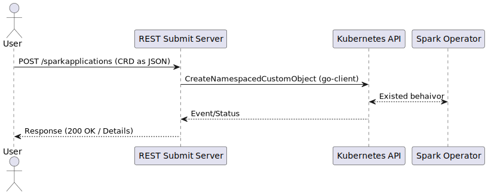

# KEP-XXXX: Add REST API Support for SparkApplication CRD

<!--
A lightweight REST API proxy for SparkApplication CRDs in the Spark Operator.
-->

## Summary

Expose a RESTful HTTP interface alongside the Spark Operator to streamline the creation, retrieval, update, listing, and deletion of `SparkApplication` Custom Resources. By bundling a minimal Go-based HTTP server that proxies JSON payloads directly to the Kubernetes API (using `client-go`), users and external systems (CI/CD pipelines, web UIs, custom dashboards) can manage Spark jobs without requiring `kubectl` or deep Kubernetes expertise.

## Motivation

Currently, submitting Spark jobs via the Spark Operator demands crafting and applying Kubernetes manifests with `kubectl` or invoking client libraries. This creates friction for non-Kubernetes-native workflows and requires boilerplate integration code in external tools.

### Goals

- Provide HTTP endpoints for CRUD operations on `SparkApplication` CRs.
- Allow cluster administrators to configure and integrate the authentication and authorization mechanisms of their choice.
- Package the REST proxy as a container alongside the Spark Operator in Helm charts or manifests.
- Ensure minimal resource overhead and operational complexity.

### Non-Goals

- Replacing general-purpose CLI tools like `kubectl` for arbitrary resources.
- Implementing extensive admission logic or API aggregation capabilities beyond basic proxying.
- Managing non-Spark CRDs or core Kubernetes objects in this phase.

## Proposal

Deploy a companion HTTP server with the Spark Operator that:

1. **Listens** on a configurable port (default 8080) inside the same pod or as a sidecar.
2. **Maps HTTP routes** to Kubernetes operations using `client-go`, operating only within a configured namespace scope:
    - `POST /sparkapplications` → Create
    - `GET /sparkapplications/{namespace}/{name}` → Get
    - `PUT /sparkapplications/{namespace}/{name}` → Update
    - `DELETE /sparkapplications/{namespace}/{name}` → Delete
    - `GET /sparkapplications?namespace={ns}` → List
3. **Accepts and returns** only JSON representations of the CRD, ensuring that manifests applied via `kubectl` or submitted via this REST API behave identically with no difference in outcomes.
4. **Leverages in-cluster config** for authentication, mounting a namespaced ServiceAccount token bound to a `Role` (or `ClusterRole`) granting access to `sparkapplications.sparkoperator.k8s.io` within that namespace.
5. **Supports TLS termination** via mounted certificates (cert-manager or manual).
6. **Emits** structured logs and exposes Prometheus metrics for request counts and latencies.

7. 

### User Stories (Optional)

#### Story 1
As a data engineer, I want to submit Spark jobs by sending a single HTTP request from my CI pipeline, so I don’t need to install or configure `kubectl` on my build agents.

#### Story 2
As a platform operator, I want to integrate Spark job submission into our internal web portal using REST calls, so that users can launch jobs without learning Kubernetes details.

#### Story 3
As a user without Kubernetes expertise, I want to use a familiar HTTP API to submit Spark jobs, so I don’t need direct cluster access or knowledge of `kubectl` commands.

### Notes/Constraints/Caveats (Optional)

- This proxy does not implement Kubernetes API aggregation; it is a user-space proxy translating HTTP to Kubernetes API calls.
- All CRD validation and defaulting is still handled by the CRD’s OpenAPI schema and the Spark Operator admission logic.
- TLS and authentication configurations must be explicitly managed by the cluster administrator.

### Risks and Mitigations

| Risk                                    | Mitigation                                                    |
|-----------------------------------------|---------------------------------------------------------------|
| Exposed HTTP endpoint could be abused   | Enforce RBAC, require ServiceAccount tokens, support TLS.     |
| Additional component to maintain        | Keep proxy logic minimal, reuse `client-go`, align with Operator releases. |
| Single point of failure for submissions | Deploy as a sidecar or with HA replica sets.                  |

## Design Details

- **Server implementation**: Go HTTP server using Gorilla Mux or standard `net/http`, calling Kubernetes API via `client-go`.
- **Deployment**: Update the Spark Operator Helm chart to include a new Deployment (or sidecar) for the REST proxy, with ServiceAccount and RBAC definitions limited to a namespace.
- **Configuration**: Helm values for port, TLS cert paths, namespace scope filter, resource limits.

### Test Plan

- **Unit Tests**: Mock `client-go` interactions to verify request-to-API mappings and error handling.
- **Integration Tests**: Deploy in a test cluster; execute CRUD operations via HTTP and assert correct CRD states.
- **E2E Tests**: Use the existing Spark Operator E2E framework to submit jobs via the proxy and verify job completion.

## Graduation Criteria

- Alpha: Basic CRUD endpoints implemented, tested in one real cluster, enabled by a feature flag in Helm.
- Beta:  Metrics, and documentation completed; rolling upgrades tested.
- Stable: No feature flag; production-grade documentation and test coverage ≥ 90%; promoted in Spark Operator release notes.

## Implementation History

- 2025-04-27: KEP created (provisional).

## Drawbacks

- Introduces an extra deployment and potential attack surface.
- May duplicate future Kubernetes API aggregation capabilities.
- Slight increase in operational complexity for cluster administrators.

## Alternatives

- **Standalone Spark Cluster**: Deploy Spark in standalone mode, which natively includes a REST submission server, eliminating the need for an additional proxy component and leveraging Spark’s built-in submission API.

