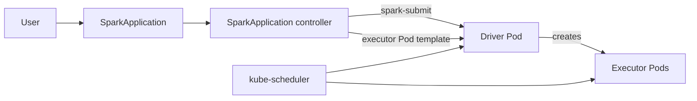
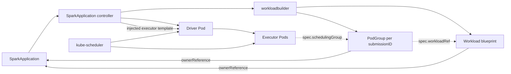
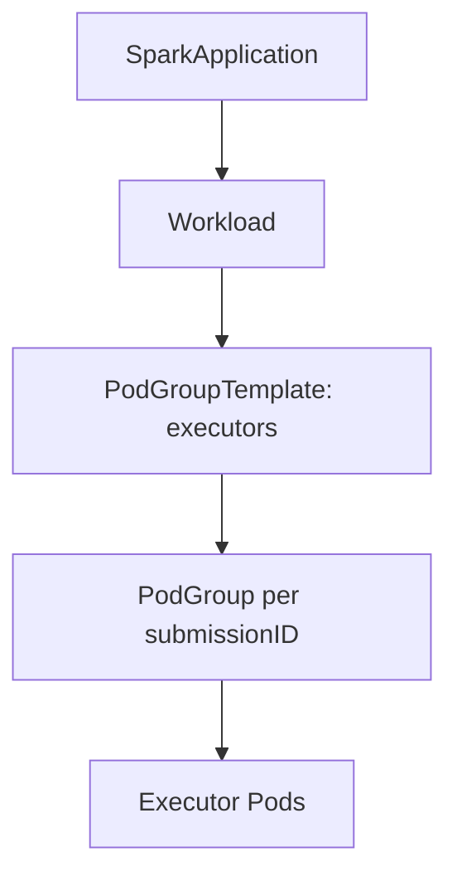
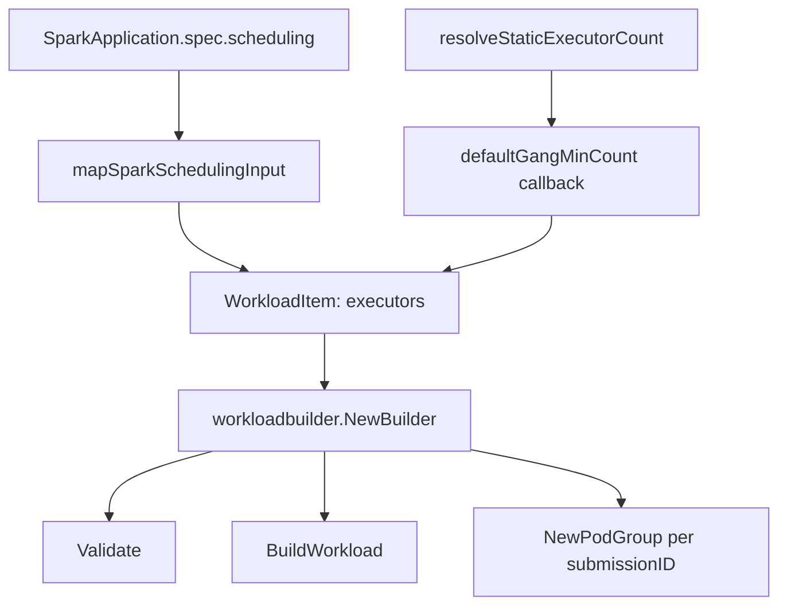
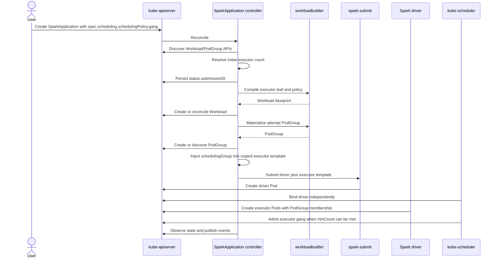
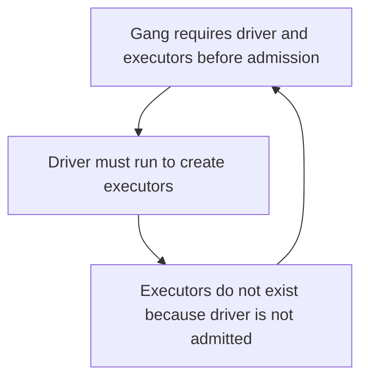
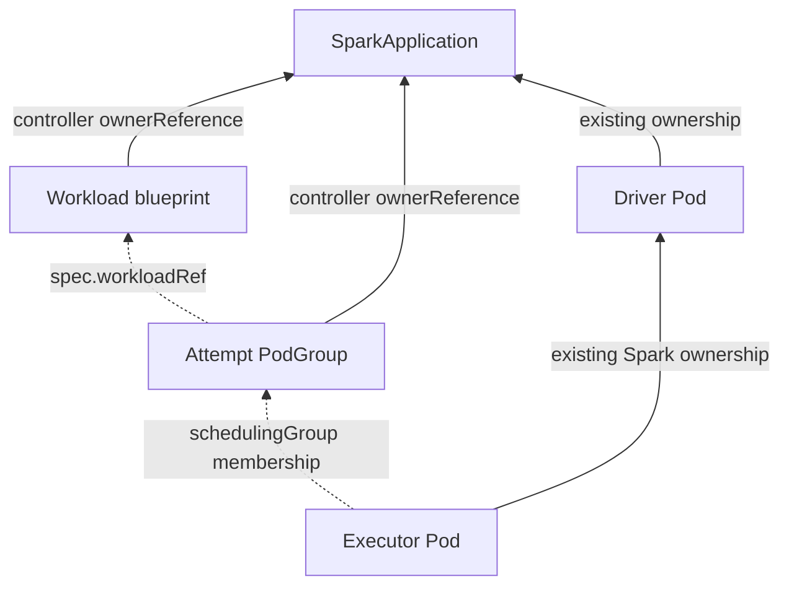
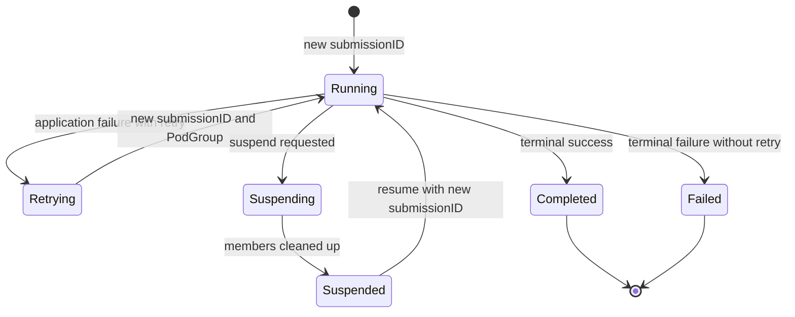

# KEP-2962: Workload-Aware Scheduling for SparkApplication

## Table of Contents

- [Summary](#summary)
  - [Alpha scope](#alpha-scope)
- [Motivation](#motivation)
  - [Goals](#goals)
  - [Future Goals](#future-goals)
  - [Non-Goals](#non-goals)
- [Proposal](#proposal)
  - [User Stories](#user-stories)
- [Design Details](#design-details)
  - [Kubernetes Workload API Overview](#kubernetes-workload-api-overview)
  - [API](#api)
  - [Defaulting](#defaulting)
  - [Validation](#validation)
  - [Controller Integration](#controller-integration)
  - [Controller Workflow](#controller-workflow)
  - [Driver/Executor Bootstrap](#driverexecutor-bootstrap)
  - [Naming Conventions](#naming-conventions)
  - [OwnerReferences Relationship](#ownerreferences-relationship)
  - [Workload Lifecycle](#workload-lifecycle)
  - [Static Executor Count](#static-executor-count)
  - [Compatibility with Existing Integrations](#compatibility-with-existing-integrations)
  - [Feature Gate Dependencies](#feature-gate-dependencies)
  - [Open Questions](#open-questions)
- [Test Plan](#test-plan)
- [Graduation Criteria](#graduation-criteria)
- [Future Plans](#future-plans)
- [Implementation History](#implementation-history)
- [Alternatives](#alternatives)

## Summary

This document proposes integrating the Kubernetes Workload API into Kubeflow Spark Operator to enable native workload-aware scheduling for `SparkApplication`. The Workload API provides:

- [Gang scheduling](https://github.com/kubernetes/enhancements/tree/master/keps/sig-scheduling/4671-gang-scheduling) (KEP-4671)
- [Topology-aware scheduling](https://github.com/kubernetes/enhancements/tree/master/keps/sig-scheduling/5732-topology-aware-workload-scheduling) (KEP-5732)
- [DRA](https://github.com/kubernetes/enhancements/tree/master/keps/sig-scheduling/5729-resourceclaim-support-for-workloads) (KEP-5729)
- Other features through `Workload` and `PodGroup` resources defined in
[KEP-6089](https://github.com/kubernetes/enhancements/tree/master/keps/sig-scheduling/6089-was-controller-apis)

An optional `.spec.scheduling` field on `SparkApplication` lets users configure Basic or Gang scheduling for executor Pods. When the field is set and the `SparkApplicationWorkloadAwareScheduling` feature gate is enabled, the SparkApplication controller creates exactly one `Workload` blueprint and one attempt-scoped `PodGroup` per submission before executor Pods are created. When the field is nil, no scheduling objects are created and behavior is unchanged.

### Alpha scope

The first implementation is intentionally narrow so reviewers can approve a reproducible MVP before dynamic allocation, topology, client modes, and other follow-up topics are designed in separate KEPs. Tracking issue [#2962](https://github.com/kubeflow/spark-operator/issues/2962) is broader than
this alpha boundary:

- cluster-mode `SparkApplication`;
- static executor allocation only;
- one logical leaf group containing executor Pods only;
- explicit `Basic` or `Gang` scheduling;
- a controller-computed Gang `minCount` equal to Spark's resolved initial executor count;
- one long-lived `Workload` blueprint per `SparkApplication`; and
- one attempt-scoped `PodGroup` per submission ID.

The cluster-mode driver is not a member of the executor gang. The driver must run before it can create executor Pods, so requiring driver and executors to schedule together would deadlock.

This KEP is **provisional**. Open decisions are listed in [Open Questions](#open-questions).

## Motivation

Spark Operator users who need gang scheduling today choose an external integration such as Volcano, YuniKorn, or scheduler-plugins. Those integrations remain useful, but they have provider-specific APIs and installation requirements.

Spark Operator already knows information users should not repeat: driver versus executor role, resolved initial executor count, submission attempt identity, executor template content, and suspend/resume/retry lifecycle. [KEP-6089](https://github.com/kubernetes/enhancements/tree/master/keps/sig-scheduling/6089-was-controller-apis) calls the highest-level controller with this complete view the **root controller** and expects it to compile native `Workload` objects. For `SparkApplication`, that is the SparkApplication controller.

Earlier prototype PRs ([#3093](https://github.com/kubeflow/spark-operator/pull/3093), [#3113](https://github.com/kubeflow/spark-operator/pull/3113), [#3116](https://github.com/kubeflow/spark-operator/pull/3116)) proved the operator can create scheduling resources and inject executor membership, but they also exposed prototype API choices such as `minMember` through legacy batch scheduler options. Agreeing on the public API and lifecycle before implementation avoids encoding those prototype shapes in the Spark CRD.

### Goals

1. Add an optional `SparkApplicationSpec.Scheduling`, serialized as `.spec.scheduling`.
2. Compose [KEP-6089](https://github.com/kubernetes/enhancements/tree/master/keps/sig-scheduling/6089-was-controller-apis) leaf-level building blocks in a Spark-owned wrapper.
3. Make `SparkApplication` the root workload and the SparkApplication controller the sole compiler
  and owner of its native `Workload`.
4. Use upstream `workloadbuilder` from
  `k8s.io/component-helpers/scheduling/schedulingv1/workloadbuilder` for translation, defaulting,
   and supported-policy validation.
5. Support cluster-mode executor Pods in one Basic or Gang `PodGroup` with the driver scheduling
  independently.
6. Compute Gang `minCount` from the same resolved initial-executor value used for Spark submission.
7. Isolate retries by creating a separate attempt-scoped `PodGroup` for every `status.submissionID`.
8. Preserve current behavior for applications that omit `.spec.scheduling`.
9. Preserve existing Volcano, YuniKorn, and scheduler-plugins integrations.
10. Apply the same validation to `ScheduledSparkApplication.spec.template`.

### Future Goals

1. Define dynamic-allocation semantics in a separate KEP.
2. Enable topology constraints, DRA resource claims, and disruption modes as upstream APIs mature.
3. Evaluate client and in-cluster-client deployment modes after validating executor template paths.
4. Define an explicit Kueue integration if queue admission coordination is required.

### Non-Goals

1. Replace, translate, or deprecate existing batch scheduler integrations.
2. Put the cluster-mode driver in the executor gang.
3. Expose a user-managed `schedulingGroup` field in the Spark CRD.
4. Let users provide Gang `minCount`; scale remains expressed by Spark executor settings.
5. Support dynamic allocation in this KEP; alpha rejects opted-in applications with dynamic
  allocation enabled.
6. Add a `CompositePodGroup` hierarchy in alpha.
7. Add native WAS behavior to `SparkConnect`.
8. Copy or maintain a Spark-specific implementation of `workloadbuilder`.
9. Maintain compatibility with Kubernetes v1.36 alpha WAS wire types from prototype PRs; Phase 0
  pins the newest KEP-6089 served API stack available at implementation time.

## Proposal

Add `.spec.scheduling` to `SparkApplicationSpec`. When the field is set and the `SparkApplicationWorkloadAwareScheduling` feature gate is enabled, the SparkApplication controller
builds one `Workload`, materializes one attempt-scoped `PodGroup`, injects `spec.schedulingGroup.podGroupName` into a deep-copied executor template, and runs the existing cluster-mode submission path. When the field is nil, no scheduling objects are created.

The key design principles are:

1. **Opt-in via the SparkApplication API.** A nil `.spec.scheduling` creates no WAS resources.
2. **One SparkApplication – one Workload.** Each SparkApplication maps to a single long-lived `Workload` containing one executor `PodGroupTemplate`.
3. **One submission attempt – one PodGroup.** Each `status.submissionID` gets its own runtime `PodGroup`; retries do not reuse a previous attempt's group.
4. `minCount` **is always computed by the controller.** Users express scale through `executor.instances` and equivalent `sparkConf`; explicit `gang.minCount` is rejected in alpha.
5. **The driver schedules independently.** Only executor Pods join the PodGroup.
6. **Lifecycle via `ownerReferences`.** The SparkApplication controller owns the `Workload` and `PodGroup`; executor Pods keep their existing Spark ownership relationships.
7. `**.spec.scheduling` is immutable in alpha.** Policy changes require a new `SparkApplication`.
8. **Common concepts stay common.** Spark composes KEP-6089 types and uses `workloadbuilder`.

### User Stories


| User need                            | Behavior                                                                                  |
| ------------------------------------ | ----------------------------------------------------------------------------------------- |
| Gang-schedule initial executors      | `schedulingPolicy.gang: {}` with static `executor.instances`; controller sets `minCount`. |
| Insufficient cluster capacity        | Executors stay unbound until the gang admits; no per-Pod fallback.                        |
| Keep ordinary Spark apps unchanged   | Omitted `scheduling` creates no WAS objects.                                              |
| Keep legacy batch schedulers working | Native WAS and `batchScheduler` are mutually exclusive.                                   |
| Retry without mixing attempts        | Each new `submissionID` gets a new PodGroup.                                              |
| Suspend and resume cleanly           | Suspend deletes the attempt PodGroup; resume creates a new submission ID.                 |
| Reject dynamic allocation            | Typed or `sparkConf` dynamic allocation with native WAS is rejected.                      |
| ScheduledSparkApplication safety     | Webhook validates `spec.template`; each child owns its own objects.                       |


#### Story: Static executor gang for Spark Pi

As a Spark user, I want four initial executor Pods admitted together. If only three slots are available, none of the executors should bind until capacity is sufficient.

```yaml
apiVersion: sparkoperator.k8s.io/v1beta2
kind: SparkApplication
metadata:
  name: spark-pi
spec:
  type: Scala
  mode: cluster
  sparkVersion: "4.0.0"
  image: spark:4.0.0
  mainClass: org.apache.spark.examples.SparkPi
  mainApplicationFile: local:///opt/spark/examples/jars/spark-examples.jar
  scheduling:
    schedulingPolicy:
      gang: {}
  driver:
    cores: 1
    memory: 1g
  executor:
    instances: 4
    cores: 1
    memory: 1g
```

When the feature gate is enabled, the controller creates:

```yaml
apiVersion: scheduling.k8s.io/v1beta1
kind: Workload
metadata:
  name: spark-pi-<stable-hash>
  ownerReferences:
    - apiVersion: sparkoperator.k8s.io/v1beta2
      kind: SparkApplication
      name: spark-pi
      controller: true
spec:
  controllerRef:
    apiGroup: sparkoperator.k8s.io
    kind: SparkApplication
    name: spark-pi
  podGroupTemplates:
    - name: executors
      schedulingPolicy:
        gang:
          minCount: 4
---
apiVersion: scheduling.k8s.io/v1beta1
kind: PodGroup
metadata:
  name: spark-pi-executors-<attempt-hash>
  ownerReferences:
    - apiVersion: sparkoperator.k8s.io/v1beta2
      kind: SparkApplication
      name: spark-pi
      controller: true
spec:
  workloadRef:
    workloadName: spark-pi-<stable-hash>
    templateName: executors
  schedulingPolicy:
    gang:
      minCount: 4
```

The ephemeral executor template sent to Spark contains:

```yaml
spec:
  schedulingGroup:
    podGroupName: spark-pi-executors-<attempt-hash>
```

## Design Details

### Kubernetes Workload API Overview

Kubernetes WAS separates a workload's logical definition from each running group:

- A `Workload` is a controller-produced blueprint with one or more `PodGroupTemplate` leaves.
- A `PodGroup` is a runtime instance materialized from one template for one submission attempt.
- Executor Pods reference the runtime `PodGroup` through native `spec.schedulingGroup`.
- `ownerReferences` express controller ownership and garbage collection; `schedulingGroup` expresses
scheduler membership only.

In cluster mode, Spark Operator submits the driver and passes an executor Pod template to Spark. The driver later creates executor Pods from that template. The operator deep-copies the executor template before submission and injects the current attempt's `schedulingGroup` reference there.




Native WAS adds scheduler-facing objects compiled by the operator:




Alpha scope maps one executor cohort to one leaf:




### API

```go
type SparkApplicationSpec struct {
    // Existing fields omitted.

    // Scheduling defines Kubernetes-native Workload-Aware Scheduling for executor Pods.
    // When nil, Spark Operator creates no native Workload or PodGroup.
    // +optional
    Scheduling *SparkApplicationSchedulingConfiguration `json:"scheduling,omitempty"`
}

type SparkApplicationSchedulingConfiguration struct {
    // SchedulingPolicy selects Basic or Gang scheduling for executor Pods.
    // +optional
    SchedulingPolicy *schedulingv1alpha3.WorkloadPodGroupSchedulingPolicy `json:"schedulingPolicy,omitempty"`

    // SchedulingConstraints, DisruptionMode, and ResourceClaims are reserved for later phases.
    // The first CRD may expose only schedulingPolicy; unsupported fields are rejected by allow-list.
    // +optional
    SchedulingConstraints *schedulingv1alpha3.WorkloadPodGroupSchedulingConstraints `json:"schedulingConstraints,omitempty"`
    // +optional
    DisruptionMode *schedulingv1alpha3.WorkloadPodGroupDisruptionMode `json:"disruptionMode,omitempty"`
    // +optional
    ResourceClaims []schedulingv1alpha3.WorkloadPodGroupResourceClaim `json:"resourceClaims,omitempty"`
}
```

The public intent types use KEP-6089 controller-facing building blocks. Runtime `Workload` and `PodGroup` examples in this KEP use the `scheduling.k8s.io/v1beta1` shape served in Kubernetes v1.37. Phase 0 must pin the exact packages and versions before implementation.

Rejected examples in alpha:

```yaml
# Dynamic allocation + native WAS
spec:
  scheduling:
    schedulingPolicy:
      gang: {}
  dynamicAllocation:
    enabled: true

# User-provided minCount
spec:
  scheduling:
    schedulingPolicy:
      gang:
        minCount: 2
  executor:
    instances: 8

# Native WAS + legacy batch scheduler
spec:
  scheduling:
    schedulingPolicy:
      gang: {}
  batchScheduler: volcano
```

Users do not set `spec.executor.schedulingGroup` in the Spark CRD. PodGroup identity is attempt-scoped controller state injected into the ephemeral executor template only.

### Defaulting

- `.spec.scheduling == nil`: do not opt in; create no native WAS objects.
- `.spec.scheduling != nil` with no `schedulingPolicy`: default the executor leaf to `Basic`.
- Explicit `gang: {}`: compute `minCount` from Spark's resolved initial executor count.

Whether an empty block should default to `Basic` or `Gang` remains an open reviewer decision.

### Validation


| Configuration                                | Result                                 | Reason                          |
| -------------------------------------------- | -------------------------------------- | ------------------------------- |
| `scheduling` omitted                         | Accept                                 | Backward compatible.            |
| Empty `scheduling: {}`                       | Accept; default Basic proposed         | Safe explicit opt-in.           |
| `schedulingPolicy.gang` without `minCount`   | Accept; controller computes `minCount` | Spark scale is source of truth. |
| User sets `gang.minCount`                    | Reject                                 | Duplicate scale configuration.  |
| Both Basic and Gang set                      | Reject                                 | Upstream policy is a union.     |
| Native WAS + dynamic allocation              | Reject                                 | Requires separate KEP.          |
| `scheduling` + `batchScheduler`              | Reject                                 | No native translation defined.  |
| User sets `spec.schedulingGroup`             | Reject                                 | Operator-managed per attempt.   |
| Unsupported topology, disruption, or claims  | Reject by allow-list                   | Fail closed.                    |
| Feature gate disabled + `scheduling` set     | Reject admission                       | Avoid unusable contract.        |
| Required Kubernetes APIs not served          | Reject at reconcile preflight          | Cached API discovery.           |
| Client or in-cluster-client mode             | Reject until supported                 | Unverified injection path.      |
| `ScheduledSparkApplication` template invalid | Reject the schedule                    | Fail before child creation.     |


Admission validates object-local rules, feature gate, static-allocation requirement, and conflicts visible in the submitted object. Reconcile preflight performs cached discovery for served Workload and PodGroup APIs. `.spec.scheduling` is immutable after creation in alpha.

A static executor-count change uses the existing invalidation flow, waits for old attempt members to disappear, updates only the mutable Workload Gang `minCount`, and creates a new submission ID and PodGroup. The controller does not delete and recreate the Workload to bypass API immutability.

### Controller Integration

`workloadbuilder` compiles one executor leaf from user policy plus controller-supplied structure:




The operator creates one `workloadbuilder.WorkloadItem` for the executor cohort:

```go
func mapSparkSchedulingInput(
    cfg *SparkApplicationSchedulingConfiguration,
) workloadbuilder.WorkloadInput {
    if cfg == nil {
        return workloadbuilder.WorkloadInput{}
    }
    return workloadbuilder.WorkloadInput{
        Policy: workloadbuilder.PolicyInput{
            PodGroupData: cfg.SchedulingPolicy,
            PathElements: []string{"schedulingPolicy"},
        },
        Constraints: workloadbuilder.ConstraintsInput{
            PodGroupData: cfg.SchedulingConstraints,
            PathElements: []string{"schedulingConstraints"},
        },
        DisruptionMode: workloadbuilder.DisruptionModeInput{
            PodGroupData: cfg.DisruptionMode,
            PathElements: []string{"disruptionMode"},
        },
        ResourceClaims: workloadbuilder.ResourceClaimsInput{
            PodGroupData: cfg.ResourceClaims,
            PathElements: []string{"resourceClaims"},
        },
    }
}

resolved := resolveStaticExecutorCount(app)

executorItem := &workloadbuilder.WorkloadItem{
    Name: "executors",
    DefaultConfig: &workloadbuilder.SchedulingConfig{
        Policy: &workloadbuilder.SchedulingPolicy{
            Basic: &workloadbuilder.BasicSchedulingPolicy{},
        },
    },
    Input: mapSparkSchedulingInput(app.Spec.Scheduling),
    Callbacks: []workloadbuilder.SchedulingConfigFunc{
        defaultGangMinCount(resolved.InitialExecutors),
    },
}

builder := workloadbuilder.NewBuilder(executorItem, workloadbuilder.BuildOptions{
    Name:      workloadName(app),
    Namespace: app.Namespace,
    Owner:     sparkApplicationOwnerReference(app),
    AllowedPolicies: []workloadbuilder.SchedulingPolicyOption{
        workloadbuilder.BasicPolicy,
        workloadbuilder.GangPolicy,
    },
    AllowedDisruptionModes: []workloadbuilder.DisruptionModeOption{
        workloadbuilder.SingleMode,
    },
})

allErrs := builder.Validate(ctx, field.NewPath("spec", "scheduling"), workloadbuilder.ValidationInput{})
workload, err := builder.BuildWorkload()
podGroup, err := builder.NewPodGroup(attemptPodGroupName(app), "executors")
```

Phase 0 pins the exact API and `workloadbuilder` versions before implementation.

### Controller Workflow




For each new submission attempt:

1. Detect `.spec.scheduling`.
2. Verify the Spark feature gate and served Workload/PodGroup APIs.
3. Reject legacy scheduler or user-provided membership conflicts.
4. Resolve initial executor count with the same resolver used for `spark-submit`.
5. Persist `status.submissionID` before creating attempt resources.
6. Build or reconcile the long-lived `Workload`.
7. Materialize or discover the current attempt `PodGroup`.
8. Deep-copy the executor template and inject `schedulingGroup.podGroupName`.
9. Submit the driver through the existing cluster-mode path.
10. Observe objects and emit events; delete stale attempt PodGroups only after member Pods disappear.

No failure path may silently fall back from Gang to ordinary per-Pod scheduling.

### Driver/Executor Bootstrap

In cluster mode, putting the driver and executors in one gang deadlocks because the driver must run before executor Pods exist:




Alpha therefore uses independent driver scheduling and one executor Basic or Gang `PodGroup`:

```text
driver:    ordinary independent scheduling
executors: one Basic or Gang PodGroup
```

### Naming Conventions

- Workload: `<truncated-app-name>-<stable-hash>`
- PodGroupTemplate: `executors`
- PodGroup: `<truncated-workload-name>-executors-<attempt-hash>`

Reconciliation identifies objects by controller UID, `spec.controllerRef`, template name, and `status.submissionID`, not by human-readable names alone.

### OwnerReferences Relationship

The SparkApplication controller sets `ownerReferences` on the `Workload` and `PodGroup`. Executor Pods keep their existing Spark ownership; they reference the attempt PodGroup only through `spec.schedulingGroup`.




Discovery rules:

1. No matching owned object: create it.
2. Exactly one matching owned compatible object: reuse it.
3. More than one match, foreign owner, or incompatible immutable policy: stop and emit a conflict;
  do not adopt or arbitrarily choose.

Every step is idempotent. The controller persists the submission ID first and treats compatible already-existing objects as success after restart.

### Workload Lifecycle


| Event                        | Workload               | PodGroup                    | Notes                           |
| ---------------------------- | ---------------------- | --------------------------- | ------------------------------- |
| New opted-in app             | Create or discover     | Create after submission ID  | Inject membership, then submit. |
| Retry                        | Preserve blueprint     | New group per submission ID | Never attach Pods to old group. |
| Static executor-count change | Update Gang `minCount` | New attempt group           | Uses invalidation flow.         |
| Suspend                      | Preserve blueprint     | Delete after members gone   | Existing stop/delete flow.      |
| Resume                       | Reuse blueprint        | New group per submission ID | Fresh driver submission.        |
| Delete SparkApplication      | GC via ownerReferences | GC via ownerReferences      | Existing deletion behavior.     |


Each generated `ScheduledSparkApplication` child owns its own Workload and PodGroups.




### Static Executor Count

The controller must use one resolver for both WAS planning and Spark submission:

```go
type ResolvedExecutorAllocation struct {
    InitialExecutors int32
}
```

For alpha:

1. Use effective executor instances after typed-field, `sparkConf`, and API-default precedence.
2. Require at least one executor for Gang.
3. Reject dynamic allocation enabled through typed fields or `sparkConf`.

### Compatibility with Existing Integrations

- **Volcano, YuniKorn, scheduler-plugins:** unchanged; mutually exclusive with native `.spec.scheduling`.
- **Kueue:** `kueue.x-k8s.io` Workload and `scheduling.k8s.io` Workload are different objects; queue admission is out of scope for this KEP.
- **Client modes:** reject until executor template injection is verified end to end.
- **SparkConnect:** out of scope.

### Feature Gate Dependencies

Spark feature gate:

```text
SparkApplicationWorkloadAwareScheduling=false
```

The gate is disabled by default for alpha. Enabling the gate alone does not create objects; `.spec.scheduling` remains the per-application opt-in.

Clusters must serve the required `scheduling.k8s.io` Workload and PodGroup APIs, and administrators must enable `GenericWorkload` and any capability-specific scheduler gates. The provisional minimum cluster baseline is Kubernetes **v1.37 or later**. Phase 0 pins the newest KEP-6089-aligned served API set available at implementation time, including [#6342](https://github.com/kubernetes/enhancements/pull/6342) `scheduling.k8s.io/v1` building blocks when landed, rather than v1.36 prototype wire types.


| Decision                | Required Phase 0 result                                                   |
| ----------------------- | ------------------------------------------------------------------------- |
| Minimum cluster version | Provisionally v1.37.                                                      |
| Upstream WAS API pin    | Newest KEP-6089 stack available at implementation time.                   |
| Go modules              | Pin matching `k8s.io/api`, `client-go`, and `component-helpers` versions. |
| Verification            | Compile selected `workloadbuilder` calls before adding the public field.  |


RBAC when enabled:

```yaml
- apiGroups: ["scheduling.k8s.io"]
  resources: ["workloads", "podgroups"]
  verbs: ["get", "list", "watch", "create", "update", "patch", "delete"]
- apiGroups: ["scheduling.k8s.io"]
  resources: ["podgroups/status"]
  verbs: ["get"]
```

Helm and Kustomize installs must grant equivalent permissions when the feature is enabled.

### Open Questions

1. Should `.spec.scheduling: {}` default to `Basic` or `Gang`?
2. Should the first CRD expose only `schedulingPolicy`, or the full wrapper with allow-list rejection?
3. Is v1.37+ an acceptable minimum cluster version for Phase 0 pinning?
4. Should native WAS be rejected when a deployment-level default batch scheduler would also apply?
5. Are Events and errors enough for alpha, or should a `WorkloadSchedulingReady` condition be added?
6. Does the selected builder require materializing a Basic runtime PodGroup?

## Test Plan

### Unit Tests

- API defaulting and validation for Basic, Gang, legacy conflicts, dynamic allocation rejection, user `minCount` rejection, user `schedulingGroup` rejection, feature-gate disabled behavior, and `ScheduledSparkApplication.spec.template` parity.
- Shared allocation resolver tests covering typed instances, `spark.executor.instances`, precedence, invalid values, and drift prevention against generated `spark-submit` arguments.
- `workloadbuilder` compilation, ownerReferences, naming, discovery/reuse, retry isolation, membership injection without mutating stored spec, and nil-scheduling no-op behavior.

### Integration Tests

- Reconcile to Workload and attempt PodGroup.
- Controller restart after Workload, PodGroup, and driver creation without duplication.
- Retry, suspend/resume, API discovery failure, gate-disabled stored object behavior, and
ScheduledSparkApplication child isolation.

At least one test must use the actual selected WAS CRDs, not only fake discovery.

### E2E Tests

On a cluster serving the Phase 0 WAS APIs:

1. Static Gang success with four executors.
2. Insufficient capacity: none bind until capacity is sufficient; no resubmission required.
3. Basic policy schedules executors independently.
4. Retry isolation across submission IDs.
5. Controller restart without duplicate objects.
6. Suspend/resume with a new PodGroup.
7. Legacy Volcano/YuniKorn/scheduler-plugins regressions unchanged.

## Graduation Criteria

### Alpha

- `SparkApplicationWorkloadAwareScheduling` exists and defaults to disabled.
- Cluster-mode Basic and static Gang policies are implemented with upstream `workloadbuilder`.
- `.spec.scheduling == nil` preserves current behavior.
- Workload and attempt PodGroup reconciliation is idempotent and restart-safe.
- Unit, integration, Helm, and E2E tests above pass.
- User documentation covers prerequisites, examples, limitations, and rollback.

### Beta

- Upstream APIs used by Spark are beta or stable across supported Kubernetes versions.
- Upgrade, downgrade, feature-disable, and controller-restart paths are tested.
- Required observability supports per-application diagnosis without controller logs.

### GA

- Relevant upstream Kubernetes APIs are GA.
- Spark's user-facing scheduling API and lifecycle semantics are stable.
- Version-skew, rollback, and static scale updates have production evidence.

## Future Plans

1. **Dynamic allocation KEP:** bootstrap sizing, elastic gangs, replacement, and scale-down.
2. **Topology and DRA KEP:** executor placement constraints and safely consumed shared claims.
3. **Client mode support** after end-to-end validation.
4. **Kueue coordination** if queue admission ownership is required.

Implementation is expected to land in small reviewable PRs after this design is accepted: API and validation, shared allocation resolver, feature gate and RBAC, Workload compiler, PodGroup and template injection, lifecycle behavior, then E2E and documentation.

## Implementation History

- 2025-10-22: Tracking issue  [#2962](https://github.com/kubeflow/spark-operator/issues/2962) opened.
- 2025-2026: Prototype work in  [#3093](https://github.com/kubeflow/spark-operator/pull/3093),  [#3113](https://github.com/kubeflow/spark-operator/pull/3113), and  [#3116](https://github.com/kubeflow/spark-operator/pull/3116); credited as evidence, not approved API.
- 2026-09-08: Initial provisional KEP.
- 2026-09-13: Aligned with KEP-6089 `workloadbuilder`, static-only alpha scope, immutable scheduling, and Phase 0 dependency pinning.
- 2026-09-13: Restructured to match the Kubeflow Trainer KEP layout and trimmed duplicate sections.

## Alternatives

### Add `minMember` to `batchSchedulerOptions`

Earlier prototypes added a low-level minimum next to provider-oriented options. This mixes Kubernetes-native policy with Volcano queue configuration and cannot grow into KEP-6089 topology, disruption, and DRA building blocks.

### Expose an operator-managed `schedulingGroup` field

PodGroup names are per attempt, not durable user intent. Membership is injected into the ephemeral executor template instead.

### Feature-gate-only automatic behavior

Enabling a controller gate could gang-schedule every SparkApplication automatically. This has no API surface and no Basic escape hatch.

### Include the driver in the gang

Deadlocks in cluster mode because the driver must run before executor Pods exist.

### One PodGroup for every retry

Reusing a PodGroup allows old and new attempt Pods to share scheduler state and makes cleanup ambiguous.

### Delegate PodGroup creation to the driver

The operator already owns the template and attempt state; centralized management is smaller for the MVP.

### Write a custom Workload builder

Duplicates KEP-6089 defaulting, validation, and version adaptation already provided by `workloadbuilder`.

### Put scheduling under executor or driver fields

A top-level `.spec.scheduling` matches Job and Trainer direction, keeps application-level policy in one place, and documents that alpha scope applies to the executor cohort.