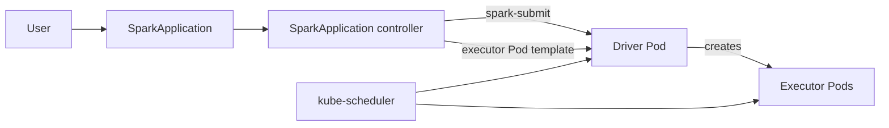
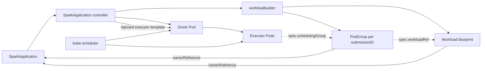
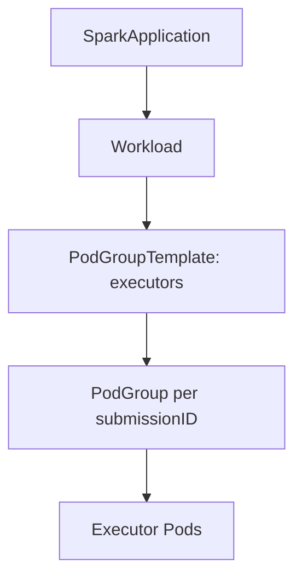
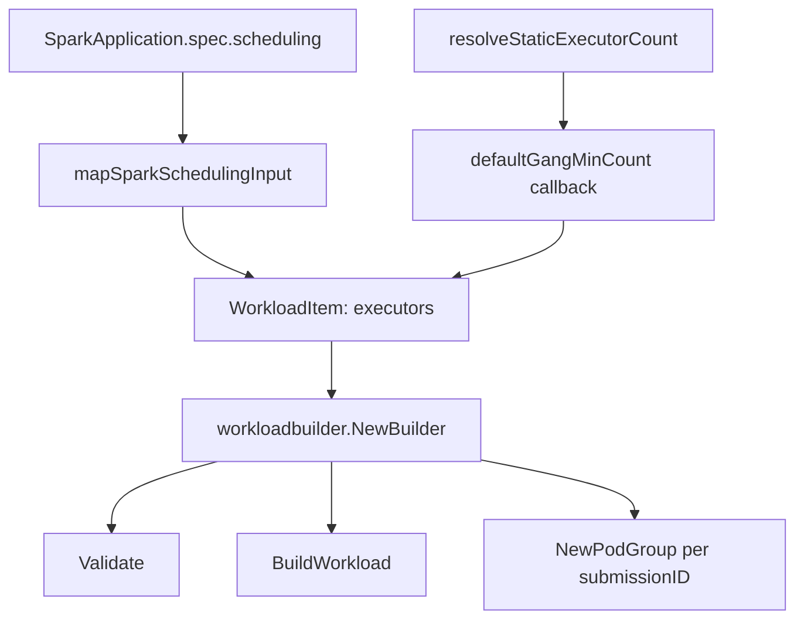
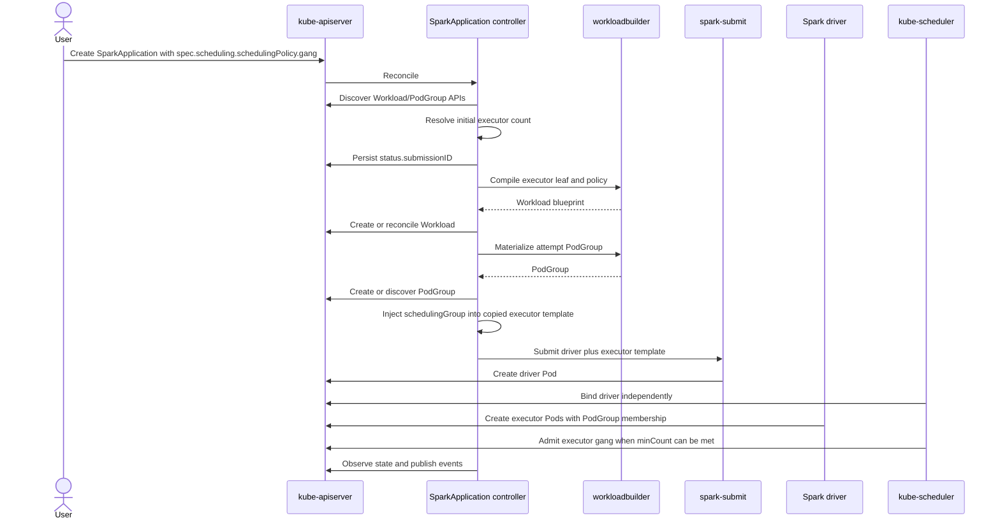
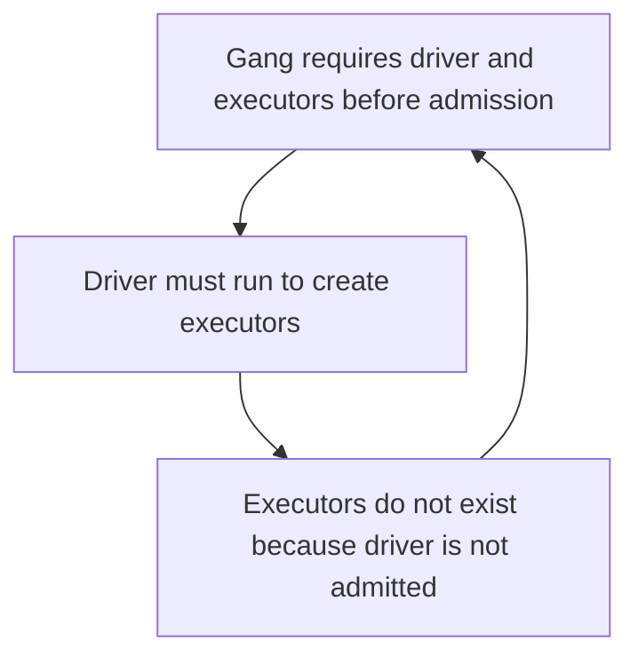
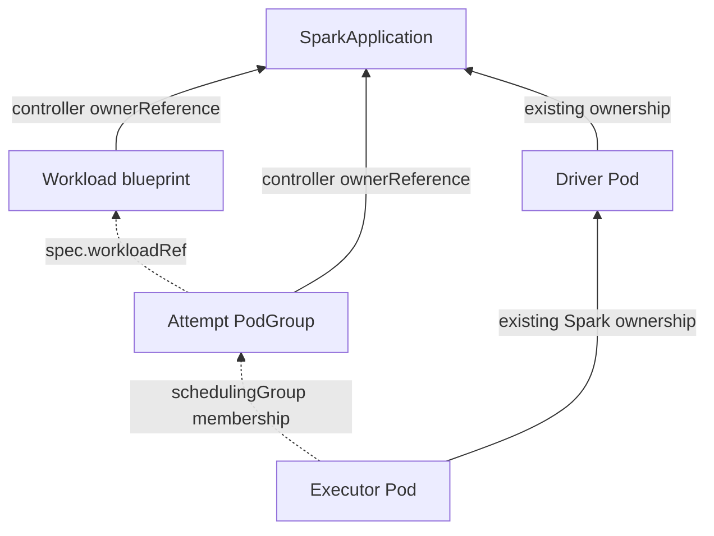
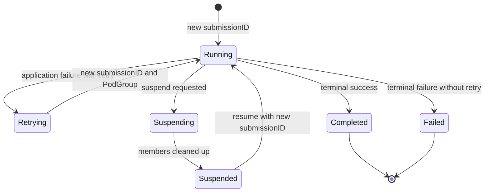

# KEP-2962: Workload-Aware Scheduling for SparkApplication

<!-- markdownlint-disable MD013 MD012 -->

## Table of Contents

- [Summary](#summary)
  - [Alpha scope](#alpha-scope)
- [Motivation](#motivation)
  - [Goals](#goals)
  - [Future Goals](#future-goals)
  - [Non-Goals](#non-goals)
- [Proposal](#proposal)
  - [User Stories](#user-stories)
- [Design Details](#design-details)
  - [Kubernetes Workload API Overview](#kubernetes-workload-api-overview)
  - [Executor Template Injection](#executor-template-injection)
  - [API](#api)
  - [Defaulting](#defaulting)
  - [Validation](#validation)
  - [Controller Integration](#controller-integration)
  - [Controller Workflow](#controller-workflow)
  - [Driver/Executor Bootstrap](#driverexecutor-bootstrap)
  - [Naming Conventions](#naming-conventions)
  - [OwnerReferences Relationship](#ownerreferences-relationship)
  - [Workload Lifecycle](#workload-lifecycle)
  - [Post-admission executor replacement](#post-admission-executor-replacement)
  - [Static Executor Count](#static-executor-count)
  - [Compatibility with Existing Integrations](#compatibility-with-existing-integrations)
  - [API Evolution and Phase 0 Pin](#api-evolution-and-phase-0-pin)
  - [Feature Gate Dependencies](#feature-gate-dependencies)
  - [Open Questions](#open-questions)
- [Test Plan](#test-plan)
- [Graduation Criteria](#graduation-criteria)
- [Future Plans](#future-plans)
- [Implementation History](#implementation-history)
- [Alternatives](#alternatives)

## Summary

This document proposes integrating the Kubernetes Workload API into Kubeflow Spark Operator to enable native workload-aware scheduling for `SparkApplication`. The Workload API provides:

- [Gang scheduling](https://github.com/kubernetes/enhancements/tree/master/keps/sig-scheduling/4671-gang-scheduling) (KEP-4671)
- [Topology-aware scheduling](https://github.com/kubernetes/enhancements/tree/master/keps/sig-scheduling/5732-topology-aware-workload-scheduling) (KEP-5732)
- [DRA](https://github.com/kubernetes/enhancements/tree/master/keps/sig-scheduling/5729-resourceclaim-support-for-workloads) (KEP-5729)
- Other features through `Workload` and `PodGroup` resources defined in
[KEP-6089](https://github.com/kubernetes/enhancements/tree/master/keps/sig-scheduling/6089-was-controller-apis)

An optional `.spec.scheduling` field on `SparkApplication` lets users configure Basic or Gang scheduling for executor Pods. When the field is set and the `SparkApplicationWorkloadAwareScheduling` feature gate is enabled, the SparkApplication controller creates exactly one `Workload` blueprint and one attempt-scoped `PodGroup` per submission before executor Pods are created. When the field is nil, no scheduling objects are created and behavior is unchanged.

### Alpha scope

The first implementation is intentionally narrow so reviewers can approve a reproducible MVP before dynamic allocation, topology, client modes, and other follow-up topics are designed in separate KEPs. Tracking issue [#2962](https://github.com/kubeflow/spark-operator/issues/2962) is broader than
this alpha boundary:

- cluster-mode `SparkApplication`;
- static executor allocation only;
- one logical leaf group containing executor Pods only;
- explicit `Basic` or `Gang` scheduling;
- a controller-computed Gang `minCount` equal to Spark's resolved initial executor count;
- one long-lived `Workload` blueprint per `SparkApplication`; and
- one attempt-scoped `PodGroup` per submission ID.

The cluster-mode driver is not a member of the executor gang. The driver must run before it can create executor Pods, so requiring driver and executors to schedule together would deadlock.

That choice has an orchestration cost. With Airflow, Argo Workflows, or similar systems that treat a Running driver or a non-terminal SparkApplication as "task started," the workflow can look in progress even when the executor gang never admits and executors never run. Alpha must expose that state with a machine-readable SparkApplication condition (not Events alone), and user documentation must warn that driver-only Running is not the same as a fully scheduled Spark job. A richer mirrored `status.workloadScheduling` object remains a beta enhancement.

It also creates a cluster-wide tradeoff. Many SparkApplications can run drivers that consume capacity while their executor gangs wait, so native WAS does not by itself provide the resource-based multi-app admission that Volcano or YuniKorn often provide. Alpha documents that limitation; those integrations stay first-class for that use case. Cluster-wide admission (Kueue, quotas, or a later composite design) is out of alpha scope.

This KEP is **provisional**. Open decisions are listed in [Open Questions](#open-questions).

## Motivation

Spark Operator users who need gang scheduling today choose an external integration such as Volcano, YuniKorn, or scheduler-plugins. Those integrations remain useful, but they have provider-specific APIs and installation requirements. They stay first-class. Native WAS does not replace them.

`GenericWorkload` is beta and disabled by default in Kubernetes v1.37, and managed Kubernetes providers generally do not expose non-default feature gates. Native WAS is therefore available first to platform teams that run their own control planes and can enable the required gates. That availability limit is a reason to keep the feature opt-in, not a reason to skip the design.

Spark Operator already knows information users should not repeat: driver versus executor role, resolved initial executor count, submission attempt identity, executor template content, and suspend/resume/retry lifecycle. [KEP-6089](https://github.com/kubernetes/enhancements/tree/master/keps/sig-scheduling/6089-was-controller-apis) calls the highest-level controller with this complete view the **root controller** and expects it to compile native `Workload` objects. For `SparkApplication`, that is the SparkApplication controller.

Earlier prototype PRs ([#3093](https://github.com/kubeflow/spark-operator/pull/3093), [#3113](https://github.com/kubeflow/spark-operator/pull/3113), [#3116](https://github.com/kubeflow/spark-operator/pull/3116)) proved the operator can create scheduling resources and inject executor membership, but they also exposed prototype API choices such as `minMember` through legacy batch scheduler options and may have targeted superseded WAS wire shapes. Agreeing on the public API and lifecycle before implementation avoids encoding those prototype shapes in the Spark CRD.

### Goals

1. Add an optional `SparkApplicationSpec.Scheduling`, serialized as `.spec.scheduling`.
2. Compose [KEP-6089](https://github.com/kubernetes/enhancements/tree/master/keps/sig-scheduling/6089-was-controller-apis) leaf-level building blocks in a Spark-owned wrapper.
3. Make `SparkApplication` the root workload and the SparkApplication controller the sole compiler
  and owner of its native `Workload`.
4. Use upstream `workloadbuilder` from
  `k8s.io/component-helpers/scheduling/schedulingv1/workloadbuilder` for translation, defaulting,
   and supported-policy validation.
5. Support cluster-mode executor Pods in one Basic or Gang `PodGroup` with the driver scheduling
  independently.
6. Compute Gang `minCount` from the same resolved initial-executor value used for Spark submission.
7. Isolate retries by creating a separate attempt-scoped `PodGroup` for every `status.submissionID`.
8. Preserve current behavior for applications that omit `.spec.scheduling`.
9. Preserve existing Volcano, YuniKorn, and scheduler-plugins integrations.
10. Apply the same validation to `ScheduledSparkApplication.spec.template`.

### Future Goals

1. Define dynamic-allocation semantics in a separate KEP.
2. Enable topology constraints, DRA resource claims, and disruption modes as upstream APIs mature.
3. Evaluate client and in-cluster-client deployment modes after validating executor template paths.
4. Expand Kueue coordination beyond the alpha coexistence contract.

### Non-Goals

1. Replace, translate, or deprecate existing batch scheduler integrations.
2. Put the cluster-mode driver in the executor gang.
3. Expose a user-managed `schedulingGroup` field in the Spark CRD.
4. Let users provide Gang `minCount` in alpha; scale remains expressed by Spark executor settings.
   A later beta may relax this to floor semantics. Alpha does not promise that the prohibition is permanent.
5. Support dynamic allocation in this KEP; alpha rejects opted-in applications with dynamic
  allocation enabled.
6. Add a `CompositePodGroup` hierarchy in alpha.
7. Add native WAS behavior to `SparkConnect`.
8. Copy or maintain a Spark-specific implementation of `workloadbuilder`.
9. Maintain compatibility with superseded WAS shapes: Kubernetes v1.36 prototype wire types,
  `scheduling.k8s.io/v1alpha1` inline `Workload.spec.podGroups`, or Pod `workloadRef` /
  `podGroupReplicaKey`. Phase 0 pins the newest KEP-6089 served API stack available at
  implementation time.
10. Solve cluster-wide multi-app admission or driver/executor resource starvation across many
  SparkApplications. Alpha keeps Volcano, YuniKorn, and scheduler-plugins for that class of
  guarantee.
11. Combine `PartialRestart` with native WAS in alpha. The two feature gates are mutually
  exclusive when `.spec.scheduling` is set.

## Proposal

Add `.spec.scheduling` to `SparkApplicationSpec`. When the field is set and the `SparkApplicationWorkloadAwareScheduling` feature gate is enabled, the SparkApplication controller
builds one `Workload`, materializes one attempt-scoped `PodGroup`, injects `spec.schedulingGroup.podGroupName` into a deep-copied executor template, and runs the existing cluster-mode submission path. When the field is nil, no scheduling objects are created.

The key design principles are:

1. **Opt-in via the SparkApplication API.** A nil `.spec.scheduling` creates no WAS resources.
2. **One SparkApplication – one Workload.** Each SparkApplication maps to a single long-lived `Workload` containing one executor `PodGroupTemplate`.
3. **One submission attempt – one PodGroup.** Each `status.submissionID` gets its own runtime `PodGroup`; retries do not reuse a previous attempt's group.
4. **`minCount` is computed by the controller in alpha.** Users express scale through `executor.instances` and equivalent `sparkConf`; explicit `gang.minCount` is rejected in alpha. A later beta may allow an explicit `minCount` as a floor that the controller will not go below.
5. **The driver schedules independently.** Only executor Pods join the PodGroup.
6. **Lifecycle via `ownerReferences`.** The SparkApplication controller owns the `Workload` and `PodGroup`; executor Pods keep their existing Spark ownership relationships.
7. **`.spec.scheduling` may change, but only on the next submission.** Mid-attempt policy mutation is rejected. A change invalidates the current attempt and takes effect with a new `submissionID` and PodGroup.
8. **Common concepts stay common.** Spark composes KEP-6089 types and uses `workloadbuilder`.
9. **No silent fallback.** Alpha enforces executor membership with template injection, webhook defense, and a post-create membership check.

### User Stories


| User need                            | Behavior                                                                                  |
| ------------------------------------ | ----------------------------------------------------------------------------------------- |
| Gang-schedule initial executors      | `schedulingPolicy.gang: {}` with static `executor.instances`; controller sets `minCount`. |
| Insufficient cluster capacity        | Executors stay unbound until the gang admits; no per-Pod fallback.                        |
| Keep ordinary Spark apps unchanged   | Omitted `scheduling` creates no WAS objects.                                              |
| Keep legacy batch schedulers working | Native WAS and `batchScheduler` are mutually exclusive.                                   |
| Retry without mixing attempts        | Each new `submissionID` gets a new PodGroup.                                              |
| Suspend and resume cleanly           | Suspend deletes the attempt PodGroup; resume creates a new submission ID.                 |
| Reject dynamic allocation            | Typed or `sparkConf` dynamic allocation with native WAS is rejected.                      |
| ScheduledSparkApplication safety     | Webhook validates `spec.template`; each child owns its own objects.                       |
| Gang never admits                    | Driver may be Running while executors stay unschedulable; no silent per-Pod fallback.    |
| Orchestrator visibility              | Airflow-style tasks must not treat driver-only Running as fully started.                 |
| Gang admission deadline              | If the gang never admits, the attempt fails after a configurable deadline.               |
| Retry identity                       | A failed attempt and a new attempt never share a PodGroup.                               |


#### Story: Static executor gang for Spark Pi

As a Spark user, I want four initial executor Pods admitted together. If only three slots are available, none of the executors should bind until capacity is sufficient.

```yaml
apiVersion: sparkoperator.k8s.io/v1beta2
kind: SparkApplication
metadata:
  name: spark-pi
spec:
  type: Scala
  mode: cluster
  sparkVersion: "4.0.0"
  image: spark:4.0.0
  mainClass: org.apache.spark.examples.SparkPi
  mainApplicationFile: local:///opt/spark/examples/jars/spark-examples.jar
  scheduling:
    schedulingPolicy:
      gang: {}
  driver:
    cores: 1
    memory: 1g
  executor:
    instances: 4
    cores: 1
    memory: 1g
```

When the feature gate is enabled, the controller creates:

```yaml
apiVersion: scheduling.k8s.io/v1beta1
kind: Workload
metadata:
  name: spark-pi-<stable-hash>
  ownerReferences:
    - apiVersion: sparkoperator.k8s.io/v1beta2
      kind: SparkApplication
      name: spark-pi
      controller: true
spec:
  controllerRef:
    apiGroup: sparkoperator.k8s.io
    kind: SparkApplication
    name: spark-pi
  podGroupTemplates:
    - name: executors
      schedulingPolicy:
        gang:
          minCount: 4
---
apiVersion: scheduling.k8s.io/v1beta1
kind: PodGroup
metadata:
  name: spark-pi-executors-<attempt-hash>
  ownerReferences:
    - apiVersion: sparkoperator.k8s.io/v1beta2
      kind: SparkApplication
      name: spark-pi
      controller: true
spec:
  workloadRef:
    workloadName: spark-pi-<stable-hash>
    templateName: executors
  schedulingPolicy:
    gang:
      minCount: 4
```

The ephemeral executor template sent to Spark contains:

```yaml
spec:
  schedulingGroup:
    podGroupName: spark-pi-executors-<attempt-hash>
```

#### Story: Gang never admits

As a Spark user, I set Gang scheduling for four executors. The driver becomes Running, but the cluster never has four free slots. I should see the application stay submitted without executors binding, and I should not see Spark fall back to scheduling executors one by one. Alpha sets a condition such as `WorkloadSchedulingReady=False` with a reason that the executor gang is not admitted, and emits supporting Events. If the gang remains unadmitted past the operator admission deadline, the attempt fails and is cleaned up rather than holding the driver forever.

#### Story: Orchestrator sees driver-only start as misleading

As a platform user running Spark from Airflow (or a similar orchestrator), my DAG task turns "running" when the driver Pod starts. If the executor gang never admits, the task still looks started while no useful work runs. I need a durable, machine-readable condition on the SparkApplication in alpha—Events alone are not enough for sensors that only poll status—so my sensor can fail, timeout, or wait on executor-gang readiness instead of driver start alone. Putting the driver into the gang is not an acceptable fix; that deadlocks cluster mode.

#### Story: Retry uses a new submission

As a Spark user, my first submission fails and the operator retries. Retry is a new submission with a new `status.submissionID`, not a restart of the same driver Pod. Pending executor Pods from the new attempt must belong only to the new PodGroup. The previous attempt's PodGroup is not reused.

## Design Details

### Kubernetes Workload API Overview

Kubernetes WAS separates a workload's logical definition from each running group:

- A `Workload` is a controller-produced blueprint with one or more `PodGroupTemplate` leaves.
- A `PodGroup` is a runtime instance materialized from one template for one submission attempt.
- Executor Pods reference the runtime `PodGroup` through native `spec.schedulingGroup`.
- `ownerReferences` express controller ownership and garbage collection; `schedulingGroup` expresses
scheduler membership only.

In cluster mode, Spark Operator submits the driver and passes an executor Pod template to Spark. The driver later creates executor Pods from that template. The operator deep-copies the executor template before submission and injects the current attempt's `schedulingGroup` reference there.


```mermaid
flowchart LR
    User[User] --> App[SparkApplication]
    App --> Controller[SparkApplication controller]
    Controller -->|spark-submit| Driver[Driver Pod]
    Controller -->|executor Pod template| Driver
    Driver -->|creates| Executors[Executor Pods]
    Scheduler[kube-scheduler] --> Driver
    Scheduler --> Executors
```


Native WAS adds scheduler-facing objects compiled by the operator:


```mermaid
flowchart LR
    App[SparkApplication] --> SO[SparkApplication controller]
    SO --> WB[workloadbuilder]
    WB --> WL[Workload blueprint]
    WB --> PG[PodGroup per submissionID]
    SO --> Driver[Driver Pod]
    SO -->|injected executor template| Driver
    Driver --> Exec[Executor Pods]
    Exec -.->|spec.schedulingGroup| PG
    PG -.->|spec.workloadRef| WL
    WL -->|ownerReference| App
    PG -->|ownerReference| App
    KS[kube-scheduler] --> Driver
    KS --> Exec
```


Alpha scope maps one executor cohort to one leaf:


```mermaid
flowchart TD
    App[SparkApplication] --> WL[Workload]
    WL --> PGT["PodGroupTemplate: executors"]
    PGT --> PG[PodGroup per submissionID]
    PG --> Exec[Executor Pods]
```

### Executor Template Injection

Unlike a Job controller, Spark Operator does not create executor Pods. In cluster mode it submits the driver and passes an executor Pod template. The Spark driver later creates executor Pods from that template. Membership therefore cannot be stamped at Pod create time by the operator. It has to travel with the template.

Alpha path:

1. The controller deep-copies the executor template for the current submission. It does not mutate the stored SparkApplication spec.
2. It sets `spec.schedulingGroup.podGroupName` to the current attempt PodGroup name.
3. The operator or submission service invokes `spark-submit` (or the REST submitter) with that template.
4. Upstream Spark materializes the template for the driver.
5. The Spark driver creates executor Pods through its Kubernetes client. For current Spark releases that client is Fabric8.

Phase 0 must verify that the selected Spark version's template load, build, and serialize path preserves `spec.schedulingGroup`. The risk is a Fabric8 model that predates the field and drops unknown Pod fields. If that version cannot preserve the field, native WAS is unsupported for that Spark version rather than silently degraded.

Alpha also enforces membership so "no silent fallback" is real:

1. **Webhook defense:** the existing pod-mutating webhook stamps or corrects `spec.schedulingGroup.podGroupName` on executor Pods for opted-in apps, using the `sparkoperator.k8s.io/submission-id` label to resolve the current attempt PodGroup.
2. **Post-create membership check:** the controller lists executor Pods for the current submission and fails closed with `WorkloadSchedulingReady=False` / `Reason=ExecutorMembershipMissing` when membership is absent or wrong.

Template injection remains the primary path. The webhook and post-create check are the defense that makes the guarantee enforceable. Alpha still rejects a user-authored `spec.schedulingGroup` on the stored executor template so attempt identity stays controller-owned.

Injection must cover both the spark-submit template-file path and the REST submitter's inline template path. Tests cover both.

### API

```go
type SparkApplicationSpec struct {
    // Existing fields omitted.

    // Scheduling defines Kubernetes-native Workload-Aware Scheduling for executor Pods.
    // When nil, Spark Operator creates no native Workload or PodGroup.
    // +optional
    Scheduling *SparkApplicationSchedulingConfiguration `json:"scheduling,omitempty"`
}

type SparkApplicationSchedulingConfiguration struct {
    // SchedulingPolicy selects Basic or Gang scheduling for executor Pods.
    // +optional
    SchedulingPolicy *schedulingv1alpha3.WorkloadPodGroupSchedulingPolicy `json:"schedulingPolicy,omitempty"`

    // SchedulingConstraints, DisruptionMode, and ResourceClaims are reserved for later phases.
    // The first CRD may expose only schedulingPolicy; unsupported fields are rejected by allow-list.
    // +optional
    SchedulingConstraints *schedulingv1alpha3.WorkloadPodGroupSchedulingConstraints `json:"schedulingConstraints,omitempty"`
    // +optional
    DisruptionMode *schedulingv1alpha3.WorkloadPodGroupDisruptionMode `json:"disruptionMode,omitempty"`
    // +optional
    ResourceClaims []schedulingv1alpha3.WorkloadPodGroupResourceClaim `json:"resourceClaims,omitempty"`
}
```

The public intent types use KEP-6089 controller-facing building blocks. The Go import path for
those structs may be `scheduling.k8s.io/v1` or `scheduling.k8s.io/v1alpha3` after
[#6342](https://github.com/kubernetes/enhancements/pull/6342); that is separate from the runtime
CRD shape.

Runtime `Workload` and `PodGroup` examples in this KEP use the `scheduling.k8s.io/v1beta1` shape
served in Kubernetes v1.37:

- `Workload` holds `podGroupTemplates`; runtime `PodGroup` objects are materialized separately.
- Pods join a group through `spec.schedulingGroup.podGroupName`, not `spec.workloadRef` (removed in
  Kubernetes 1.36).
- Gang `minCount` is mutable on the runtime `PodGroup`, not on the superseded inline
  `Workload.spec.podGroups` list from `scheduling.k8s.io/v1alpha1`.

Phase 0 must pin the exact packages and versions before implementation. See
[API Evolution and Phase 0 Pin](#api-evolution-and-phase-0-pin).

Rejected examples in alpha:

```yaml
# Dynamic allocation + native WAS
spec:
  scheduling:
    schedulingPolicy:
      gang: {}
  dynamicAllocation:
    enabled: true

# User-provided minCount
spec:
  scheduling:
    schedulingPolicy:
      gang:
        minCount: 2
  executor:
    instances: 8

# Native WAS + legacy batch scheduler
spec:
  scheduling:
    schedulingPolicy:
      gang: {}
  batchScheduler: volcano
```

Users do not set `spec.executor.schedulingGroup` in the Spark CRD. PodGroup identity is attempt-scoped controller state injected into the ephemeral executor template only.

### Defaulting

- `.spec.scheduling == nil`: do not opt in; create no native WAS objects.
- `.spec.scheduling != nil` with no `schedulingPolicy`: default the executor leaf to `Basic`.
- Explicit `gang: {}`: compute `minCount` from Spark's resolved initial executor count.

Whether an empty block should default to `Basic` or `Gang` remains an open reviewer decision.

### Validation


| Configuration                                | Result                                 | Reason                          |
| -------------------------------------------- | -------------------------------------- | ------------------------------- |
| `scheduling` omitted                         | Accept                                 | Backward compatible.            |
| Empty `scheduling: {}`                       | Accept; default Basic proposed         | Safe explicit opt-in.           |
| `schedulingPolicy.gang` without `minCount`   | Accept; controller computes `minCount` | Spark scale is source of truth. |
| User sets `gang.minCount`                    | Reject                                 | Duplicate scale configuration.  |
| Both Basic and Gang set                      | Reject                                 | Upstream policy is a union.     |
| Native WAS + dynamic allocation              | Reject                                 | Requires separate KEP.          |
| `scheduling` + `batchScheduler`              | Reject                                 | No native translation defined.  |
| User sets `spec.schedulingGroup`             | Reject                                 | Operator-managed per attempt.   |
| Non-default / non-WAS scheduler name         | Reject                                 | Conflicts with native WAS.      |
| Typed `driver`/`executor.schedulerName` conflict | Reject                              | Same as sparkConf scheduler keys. |
| `maxPendingPods` below Gang `minCount`       | Reject                                 | Gang can never become ready.    |
| `PartialRestart` enabled with native WAS     | Reject                                 | Mutually exclusive in alpha.    |
| Unsupported topology, disruption, or claims  | Reject by allow-list                   | Fail closed.                    |
| Feature gate disabled + `scheduling` set     | Reject admission                       | Avoid unusable contract.        |
| Required Kubernetes APIs not served          | Reject at reconcile preflight          | Cached API discovery.           |
| Client or in-cluster-client mode             | Reject until supported                 | Unverified injection path.      |
| `ScheduledSparkApplication` template invalid | Reject the schedule                    | Fail before child creation.     |


Admission validates object-local rules, feature gate, static-allocation requirement, and conflicts visible in the submitted object on create and update. Reconcile preflight performs cached discovery for served Workload and PodGroup APIs.

`.spec.scheduling` may change after creation. A change does not mutate the current attempt in place. It invalidates the application and takes effect on the next submission with a new `submissionID` and PodGroup.

Scheduler-name conflicts include typed `spec.driver.schedulerName` / `spec.executor.schedulerName` and the sparkConf keys `spark.kubernetes.scheduler.name`, `spark.kubernetes.driver.scheduler.name`, and `spark.kubernetes.executor.scheduler.name`. Alpha deliberately simplifies to empty or `default-scheduler` only. The long-term rule is that the selected scheduler must serve the Workload API; a named kube-scheduler profile that serves WAS may be allowed after Phase 0 verification. `spark.kubernetes.allocation.maxPendingPods` is rejected when it is set below the resolved Gang `minCount`, because the driver would never request enough pending executors for the gang to admit.

When `.spec.scheduling` is set, the `PartialRestart` feature gate is mutually exclusive with native WAS in alpha. Webhook-only executor updates that would otherwise skip invalidation (`schedulerName`, `nodeSelector`, `tolerations`, `affinity`, `priorityClassName`) must not join the current attempt PodGroup with different placement or scheduler settings. Those changes go through invalidation instead, or the combination is rejected at admission.

A static executor-count change uses the existing invalidation flow, waits for old attempt members
to disappear, updates the `Workload` blueprint template where individual fields allow it, and
creates a new submission ID and runtime `PodGroup` with the resolved Gang `minCount`. The mutable
field in v1.37 is `PodGroup.spec.schedulingPolicy.gang.minCount`; the controller does not delete
and recreate the `Workload` to bypass template immutability rules.

### Controller Integration

`workloadbuilder` compiles one executor leaf from user policy plus controller-supplied structure:


```mermaid
flowchart TD
    Input["SparkApplication.spec.scheduling"] --> Map["mapSparkSchedulingInput"]
    Count["resolveStaticExecutorCount"] --> Callback["defaultGangMinCount callback"]
    Map --> Item["WorkloadItem: executors"]
    Callback --> Item
    Item --> Builder["workloadbuilder.NewBuilder"]
    Builder --> Validate["Validate"]
    Builder --> WL["BuildWorkload"]
    Builder --> PG["NewPodGroup per submissionID"]
```


The operator creates one `workloadbuilder.WorkloadItem` for the executor cohort:

```go
func mapSparkSchedulingInput(
    cfg *SparkApplicationSchedulingConfiguration,
) workloadbuilder.WorkloadInput {
    if cfg == nil {
        return workloadbuilder.WorkloadInput{}
    }
    return workloadbuilder.WorkloadInput{
        Policy: workloadbuilder.PolicyInput{
            PodGroupData: cfg.SchedulingPolicy,
            PathElements: []string{"schedulingPolicy"},
        },
        Constraints: workloadbuilder.ConstraintsInput{
            PodGroupData: cfg.SchedulingConstraints,
            PathElements: []string{"schedulingConstraints"},
        },
        DisruptionMode: workloadbuilder.DisruptionModeInput{
            PodGroupData: cfg.DisruptionMode,
            PathElements: []string{"disruptionMode"},
        },
        ResourceClaims: workloadbuilder.ResourceClaimsInput{
            PodGroupData: cfg.ResourceClaims,
            PathElements: []string{"resourceClaims"},
        },
    }
}

resolved := resolveStaticExecutorCount(app)

executorItem := &workloadbuilder.WorkloadItem{
    Name: "executors",
    DefaultConfig: &workloadbuilder.SchedulingConfig{
        Policy: &workloadbuilder.SchedulingPolicy{
            Basic: &workloadbuilder.BasicSchedulingPolicy{},
        },
    },
    Input: mapSparkSchedulingInput(app.Spec.Scheduling),
    Callbacks: []workloadbuilder.SchedulingConfigFunc{
        defaultGangMinCount(resolved.InitialExecutors),
    },
}

builder := workloadbuilder.NewBuilder(executorItem, workloadbuilder.BuildOptions{
    Name:      workloadName(app),
    Namespace: app.Namespace,
    Owner:     sparkApplicationOwnerReference(app),
    AllowedPolicies: []workloadbuilder.SchedulingPolicyOption{
        workloadbuilder.BasicPolicy,
        workloadbuilder.GangPolicy,
    },
    AllowedDisruptionModes: []workloadbuilder.DisruptionModeOption{
        workloadbuilder.SingleMode,
    },
})

allErrs := builder.Validate(ctx, field.NewPath("spec", "scheduling"), workloadbuilder.ValidationInput{})
workload, err := builder.BuildWorkload()
podGroup, err := builder.NewPodGroup(attemptPodGroupName(app), "executors")
```

Phase 0 pins the exact API and `workloadbuilder` versions before implementation.

### Controller Workflow


```mermaid
sequenceDiagram
    actor User
    participant API as kube-apiserver
    participant SO as SparkApplication controller
    participant WB as workloadbuilder
    participant Submit as spark-submit
    participant Driver as Spark driver
    participant KS as kube-scheduler

    User->>API: Create SparkApplication with spec.scheduling.schedulingPolicy.gang
    API->>SO: Reconcile
    SO->>API: Discover Workload/PodGroup APIs
    SO->>SO: Resolve initial executor count
    SO->>API: Persist status.submissionID
    SO->>WB: Compile executor leaf and policy
    WB-->>SO: Workload blueprint
    SO->>API: Create or reconcile Workload
    SO->>WB: Materialize attempt PodGroup
    WB-->>SO: PodGroup
    SO->>API: Create or discover PodGroup
    SO->>SO: Inject schedulingGroup into copied executor template
    SO->>Submit: Submit driver plus executor template
    Submit->>API: Create driver Pod
    KS->>API: Bind driver independently
    Driver->>API: Create executor Pods with PodGroup membership
    KS->>API: Admit executor gang when minCount can be met
    SO->>API: Observe state and publish events
```


For each new submission attempt:

1. Detect `.spec.scheduling`.
2. Verify the Spark feature gate and served Workload/PodGroup APIs.
3. Reject legacy scheduler or user-provided membership conflicts.
4. Resolve initial executor count with the same resolver used for `spark-submit`.
5. Persist `status.submissionID` **before** creating attempt resources. This is an intentional change from today's path, which mints the ID in memory and only persists it after submit returns. The early status write needs its own conflict handling.
6. Build or reconcile the long-lived `Workload`.
7. Materialize or discover the current attempt `PodGroup`.
8. Deep-copy the executor template and inject `schedulingGroup.podGroupName` for both spark-submit template files and the REST submitter's inline templates.
9. Submit the driver through the existing cluster-mode path.
10. Observe objects, update `WorkloadSchedulingReady`, and emit Events. On each reconcile, delete owned PodGroups whose `sparkoperator.k8s.io/submission-id` label is not equal to the current `status.submissionID`, gated on no remaining members. Those are stale attempts (for example after a retry minted a new ID while an earlier PodGroup was already created). Rely on API deletion protection while members still exist.
11. If the attempt PodGroup is not admitted before the configurable **executor-gang admission deadline**, fail the attempt, clean up, and surface the timeout on the condition.

No failure path may silently fall back from Gang to ordinary per-Pod scheduling. Webhook membership stamping and the post-create membership check enforce that guarantee.

### Driver/Executor Bootstrap

In cluster mode, putting the driver and executors in one gang deadlocks because the driver must run before executor Pods exist:


```mermaid
flowchart TD
    A[Gang requires driver and executors before admission]
    B[Driver must run to create executors]
    C[Executors do not exist because driver is not admitted]
    A --> B --> C --> A
```


Alpha therefore uses independent driver scheduling and one executor Basic or Gang `PodGroup`:

```text
driver:    ordinary independent scheduling
executors: one Basic or Gang PodGroup
```

Because the driver can become Running before the executor gang admits, orchestrators that key off driver start or a non-terminal SparkApplication phase can misreport progress. Alpha must set `WorkloadSchedulingReady` (or an equivalent condition) when the attempt PodGroup is not admitted, and emit supporting Events. User docs must state that driver Running alone does not mean the Spark job has the resources to execute.

Alpha also defines a configurable **executor-gang admission deadline**. If the gang remains unadmitted after that deadline, the controller fails the attempt and cleans up. Spark's native executor timeouts do not cover executors that exist as Pending behind gang admission, so without an operator deadline starved drivers can accumulate indefinitely.

Fixing the intra-app bootstrap deadlock does not solve inter-app starvation: many drivers can consume capacity while executor gangs wait. Alpha documents that tradeoff and keeps Volcano, YuniKorn, and scheduler-plugins for resource-based multi-app admission.

### Naming Conventions

- Workload: `<truncated-app-name>-<stable-hash>`
- PodGroupTemplate: `executors`
- PodGroup: `<truncated-workload-name>-executors-<attempt-hash>`

`<attempt-hash>` is a hash of `status.submissionID`, so restart discovery is reproducible from the persisted submission ID.

The controller also sets `sparkoperator.k8s.io/submission-id` on the attempt PodGroup. Reconciliation identifies objects by controller UID, `spec.controllerRef`, template name, the submission-id label, and `status.submissionID`, not by human-readable names alone.

### OwnerReferences Relationship

The SparkApplication controller sets `ownerReferences` on the `Workload` and `PodGroup`. Executor Pods keep their existing Spark ownership; they reference the attempt PodGroup only through `spec.schedulingGroup`.


```mermaid
flowchart BT
    Executor[Executor Pod]
    Driver[Driver Pod]
    PG[Attempt PodGroup]
    WL[Workload blueprint]
    App[SparkApplication]

    WL -->|controller ownerReference| App
    PG -->|controller ownerReference| App
    PG -.->|spec.workloadRef| WL
    Driver -->|existing ownership| App
    Executor -->|existing Spark ownership| Driver
    Executor -.->|schedulingGroup membership| PG
```


Discovery rules:

1. No matching owned object: create it.
2. Exactly one matching owned compatible object: reuse it.
3. More than one match, foreign owner, or incompatible immutable policy: stop and emit a conflict;
  do not adopt or arbitrarily choose.

Every step is idempotent. The controller persists the submission ID first and treats compatible already-existing objects as success after restart.

### Workload Lifecycle


| Event | Workload | PodGroup | Notes |
| --- | --- | --- | --- |
| New opted-in app | Create or discover | Create after submission ID | Inject membership, then submit. |
| Retry | Preserve blueprint | New group per submission ID | New submission, not a driver restart. |
| Static executor-count change | Update blueprint if needed | New group with resolved `minCount` | Uses invalidation flow. |
| `.spec.scheduling` change | Update blueprint if needed | New group on next submission | Takes effect after invalidation. |
| Gang admission deadline exceeded | Preserve blueprint | Delete after fail | Attempt fails; condition set. |
| Suspend | Preserve blueprint | Delete the attempt PodGroup | API deletion protection waits for members. |
| Resume | Reuse blueprint | New group per submission ID | Fresh submission and driver. |
| Delete SparkApplication | GC via ownerReferences | GC via ownerReferences | Existing deletion behavior. |


Each generated `ScheduledSparkApplication` child owns its own Workload and PodGroups.

Retry creates a new `status.submissionID` and a new driver submission. It does not restart the previous driver Pod in place.

Suspend stops the current attempt. The controller deletes that attempt's PodGroup and relies on PodGroup deletion protection so the object is not removed while member Pods still exist ([KEP-4671](https://github.com/kubernetes/enhancements/blob/master/keps/sig-scheduling/4671-gang-scheduling/README.md)). The Workload blueprint stays. Resume is a new submission ID and a new PodGroup. Deleting the attempt group avoids mixing old and new executor membership, which is why this differs from controllers that keep one long-lived group for a stable replica set.

### Post-admission executor replacement

Static allocation still replaces lost executors. When an executor is lost (OOM, drain, preemption), Spark's Kubernetes allocator creates a new Pod from the same template to restore the target count. That replacement carries the injected `schedulingGroup` and joins the **already-admitted** attempt PodGroup.

Alpha expected behavior: after the gang has been admitted, a replacement schedules as a normal member of an already-satisfied group and must **not** re-require a full `minCount` quorum. If it did, a single replacement could pend forever while the app runs degraded with no signal. Phase 0 must verify this against upstream PodGroup semantics (KEP-4671 / KEP-6089). If upstream differs, the observed behavior is pinned in the KEP before implementation. An E2E case kills one executor after admission and asserts the replacement schedules.


```mermaid
stateDiagram-v2
    [*] --> Running: new submissionID
    Running --> Retrying: application failure with retry
    Retrying --> Running: new submissionID and PodGroup
    Running --> Suspending: suspend requested
    Suspending --> Suspended: members cleaned up
    Suspended --> Running: resume with new submissionID
    Running --> Completed: terminal success
    Running --> Failed: terminal failure without retry
    Completed --> [*]
    Failed --> [*]
```


### Static Executor Count

The controller must use one resolver for both WAS planning and Spark submission:

```go
type ResolvedExecutorAllocation struct {
    InitialExecutors int32
}
```

For alpha:

1. Resolve the initial executor count with the same precedence the operator already uses for `spark-submit`:
   - `spec.executor.instances`, when set, is submitted after `sparkConf` and wins;
   - otherwise `spark.executor.instances`;
   - otherwise the API default of 1 when dynamic allocation is disabled.
2. Require at least one executor for Gang.
3. Reject dynamic allocation enabled through typed fields or `sparkConf`.

`minCount` uses that resolved value. Alpha does not accept a user-supplied `gang.minCount`, because Spark already has two scale surfaces. This is an alpha validation rule, not a permanent API promise. A later beta may allow an explicit `minCount` only as a floor that cannot exceed the resolved executor count.

### Compatibility with Existing Integrations

- **Volcano, YuniKorn, scheduler-plugins:** unchanged; mutually exclusive with native `.spec.scheduling`. They remain the recommended path when platforms need resource-based multi-app admission that native WAS alpha does not provide.
- **Default batch scheduler:** explicit `.spec.scheduling` takes precedence over a deployment-level `--default-batch-scheduler`. Explicit `.spec.scheduling` together with explicit `.spec.batchScheduler` or `batchSchedulerOptions` is an admission error. When neither native scheduling nor a batch scheduler is set, behavior is unchanged.
- **Scheduler backend registry:** the public opt-in remains `.spec.scheduling` only; alpha does not add a public `batchScheduler: was` name. Internally, native WAS may reuse the existing scheduler registry/interface for lifecycle hooks and mutual exclusion.
- **PartialRestart:** mutually exclusive with native WAS in alpha when `.spec.scheduling` is set.
- **Kueue:** `kueue.x-k8s.io` Workload and `scheduling.k8s.io` Workload are different objects. Alpha coexistence contract: Kueue may admit the SparkApplication; native WAS places the executor gang after that admission; if the gang never admits, the operator's admission deadline fails the attempt so quota can be released rather than held forever. Full mutation-ownership and timeout-owner design remains a follow-up KEP.
- **Client modes:** reject until executor template injection is verified end to end.
- **SparkConnect:** out of scope.

### API Evolution and Phase 0 Pin

The operator's current `go.mod` predates the v1.37 WAS APIs. Reviewers inspecting
`k8s.io/api` types from older module pins may see a different shape than this KEP targets.
Phase 0 must bump `k8s.io/api`, `client-go`, and `component-helpers` to the v1.37+ stack and
verify the served API before implementation.

| Topic | Superseded (`scheduling.k8s.io/v1alpha1`, ~Kubernetes 1.35) | KEP target (`scheduling.k8s.io/v1beta1`, Kubernetes 1.37+) |
| --- | --- | --- |
| `PodGroup` | Inline in `Workload.spec.podGroups` (immutable list) | Standalone CRD with `status` |
| Pod membership | `pod.spec.workloadRef` + `podGroupReplicaKey` | `pod.spec.schedulingGroup.podGroupName` |
| Retry isolation | `PodGroupReplicaKey` on Pod | New runtime `PodGroup` per `submissionID` |
| Gang `minCount` | Not updatable on inline groups | Mutable on runtime `PodGroup` |
| RBAC | `podgroups` resource not served | `workloads`, `podgroups`, `podgroups/status` |

Implementation must not target the v1alpha1 wire shape visible in the operator's current
`go.mod`. Per-attempt isolation stays as one runtime `PodGroup` per `submissionID` plus
`schedulingGroup` injection, following the KEP-6089 centralized-management model used by Job
and Trainer.

### Feature Gate Dependencies

Spark feature gate:

```text
SparkApplicationWorkloadAwareScheduling=false
```

The gate is disabled by default for alpha. Enabling the gate alone does not create objects; `.spec.scheduling` remains the per-application opt-in.

Clusters must serve the required `scheduling.k8s.io` Workload and PodGroup APIs, and administrators must enable `GenericWorkload` and any capability-specific scheduler gates. The provisional minimum cluster baseline is Kubernetes **v1.37 or later**. Phase 0 pins the newest KEP-6089-aligned served API set available at implementation time, including [#6342](https://github.com/kubernetes/enhancements/pull/6342) `scheduling.k8s.io/v1` building blocks when landed, rather than v1.36 prototype wire types.


| Decision | Required Phase 0 result |
| --- | --- |
| Minimum cluster version | Provisionally v1.37. |
| Upstream WAS API pin | Newest KEP-6089 stack available at implementation time. |
| Go modules | Pin matching `k8s.io/api`, `client-go`, and `component-helpers` versions. |
| Served CRDs | `scheduling.k8s.io` **Workload** and **PodGroup** (standalone). |
| Pod membership field | `spec.schedulingGroup` present in pinned `core/v1`. |
| Rejected shapes | No dependency on v1alpha1 inline `podGroups` or Pod `workloadRef`. |
| Verification | `workloadbuilder` compiles; client can create/list **PodGroup**; RBAC matches served resources; selected Spark/Fabric8 path preserves `schedulingGroup`; post-admission replacement schedules without re-requiring full `minCount`. |
| Admission deadline default | Pin the alpha default timeout value before implementation. |


RBAC when enabled:

```yaml
- apiGroups: ["scheduling.k8s.io"]
  resources: ["workloads", "podgroups"]
  verbs: ["get", "list", "watch", "create", "update", "patch", "delete"]
- apiGroups: ["scheduling.k8s.io"]
  resources: ["podgroups/status"]
  verbs: ["get"]
```

Helm and Kustomize installs must grant equivalent permissions when the feature is enabled. These
rules apply when the cluster serves standalone `PodGroup` resources (Kubernetes 1.37+); they do
not apply to the superseded v1alpha1 inline model.

### Open Questions

1. Should `.spec.scheduling: {}` default to `Basic` or `Gang`?
2. Should the first CRD expose only `schedulingPolicy`, or the full wrapper with allow-list rejection?
3. Is v1.37+ an acceptable minimum cluster version for Phase 0 pinning? (Provisional yes; confirm
   after Phase 0 module bump and API discovery.)
4. Does the selected builder require materializing a Basic runtime PodGroup?
5. What default value should the executor-gang admission deadline use in alpha?

Resolved for this KEP, pending reviewer objection:

- Explicit `.spec.scheduling` beats `--default-batch-scheduler`. Both explicit native scheduling and an explicit batch scheduler are rejected. Neither set means unchanged behavior.
- Alpha observability includes a minimal `WorkloadSchedulingReady` (or equivalent) condition plus supporting Events. A richer mirrored `status.workloadScheduling` object is a beta enhancement. Orchestrators that only poll status must be able to detect driver Running with gang not ready in alpha.
- `.spec.scheduling` may change and takes effect on the next submission after invalidation; mid-attempt mutation is rejected.
- `PartialRestart` and native WAS are mutually exclusive in alpha.
- Internal scheduler-registry reuse is allowed; no public `batchScheduler: was` name.
- Alpha Kueue coexistence: Kueue admits the app; WAS places the gang; the operator admission deadline fails the attempt if the gang never admits.
- Post-admission static executor replacement schedules on an already-satisfied PodGroup and does not re-require full `minCount`.

## Test Plan

### Unit Tests

- API defaulting and validation for Basic, Gang, legacy conflicts, dynamic allocation rejection, user `minCount` rejection, typed and sparkConf scheduler-name conflicts, `maxPendingPods` below `minCount`, PartialRestart mutual exclusion, user `schedulingGroup` rejection, feature-gate disabled behavior, and `ScheduledSparkApplication.spec.template` parity.
- Shared allocation resolver tests covering typed instances, `spark.executor.instances`, precedence, invalid values, and drift prevention against generated `spark-submit` arguments.
- `workloadbuilder` compilation, ownerReferences, naming, discovery/reuse, retry isolation, membership injection for spark-submit and REST paths without mutating stored spec, webhook membership stamping, post-create membership check, stale PodGroup cleanup, admission-deadline failure, and nil-scheduling no-op behavior.

### Integration Tests

- Reconcile to Workload and attempt PodGroup.
- Persist `submissionID` before Workload/PodGroup creation, including conflict retries.
- Controller restart after Workload, PodGroup, and driver creation without duplication.
- Orphan/stale PodGroup cleanup when `submission-id` label differs from current `status.submissionID`.
- Retry, suspend/resume, API discovery failure, gate-disabled stored object behavior, and
ScheduledSparkApplication child isolation.
- Membership-missing condition when an executor Pod lacks the expected `schedulingGroup`.

At least one test must use the actual selected WAS CRDs, not only fake discovery.

### E2E Tests

On a cluster serving the Phase 0 WAS APIs:

1. Static Gang success with four executors.
2. Insufficient capacity: none bind until capacity is sufficient; no resubmission required; `WorkloadSchedulingReady=False` while the driver may already be Running.
3. Admission deadline: gang never admits; attempt fails and cleans up.
4. Basic policy schedules executors independently.
5. Retry isolation across submission IDs.
6. Controller restart without duplicate objects.
7. Suspend/resume with a new PodGroup.
8. Kill one executor after gang admission; replacement schedules without re-blocking on full `minCount`.
9. Legacy Volcano/YuniKorn/scheduler-plugins regressions unchanged.

## Graduation Criteria

### Alpha

- `SparkApplicationWorkloadAwareScheduling` exists and defaults to disabled.
- Cluster-mode Basic and static Gang policies are implemented with upstream `workloadbuilder`.
- `.spec.scheduling == nil` preserves current behavior.
- Workload and attempt PodGroup reconciliation is idempotent and restart-safe.
- `status.submissionID` is persisted before Workload/PodGroup creation; stale attempt PodGroups are cleaned up.
- Template injection, webhook membership defense, and post-create membership checks enforce no silent per-Pod fallback.
- When the executor gang does not admit, `WorkloadSchedulingReady=False` (or equivalent) distinguishes driver Running from executor-gang not ready.
- A configurable executor-gang admission deadline fails and cleans up attempts that never admit.
- `PartialRestart` is mutually exclusive with native WAS.
- Post-admission static executor replacement schedules without re-requiring full `minCount`.
- Unit, integration, Helm, and E2E tests above pass.
- User documentation covers prerequisites, examples, limitations, rollback, the orchestrator pitfall, and the inter-app starvation tradeoff vs Volcano/YuniKorn.

### Beta

- Upstream APIs used by Spark are beta or stable across supported Kubernetes versions.
- Upgrade, downgrade, feature-disable, and controller-restart paths are tested.
- Required observability supports per-application diagnosis without controller logs, including a richer mirrored `status.workloadScheduling` object when useful.
- Revisit user-supplied Gang `minCount` only as a floor, if Spark scale and WAS scale can stay consistent.
- Revisit PartialRestart coexistence (for example force invalidation on webhook-only field changes) if finer UX is needed.
- Named kube-scheduler profiles that serve WAS may replace the alpha empty/`default-scheduler` simplification.

### GA

- Relevant upstream Kubernetes APIs are GA.
- Spark's user-facing scheduling API and lifecycle semantics are stable.
- Version-skew, rollback, and static scale updates have production evidence.

## Future Plans

1. **Dynamic allocation KEP:** bootstrap sizing, elastic gangs, replacement under elastic scale, and scale-down. Static post-admission replacement is defined in this KEP, not deferred.
2. **Topology and DRA KEP:** executor placement constraints and safely consumed shared claims.
3. **Client mode support** after end-to-end validation.
4. **Kueue coordination** beyond the alpha coexistence contract: quota size versus Gang `minCount`, preserving Kueue Pod mutations while injecting `schedulingGroup`, and explicit timeout-owner semantics when Kueue has admitted quota but WAS cannot place the gang.
5. **Cluster-wide admission** options if platforms need stronger multi-app guarantees than driver-outside-gang native WAS provides.

Implementation is expected to land in small reviewable PRs after this design is accepted: API and validation, shared allocation resolver, feature gate and RBAC, Workload compiler, PodGroup and template injection, webhook membership defense, lifecycle and admission deadline, then E2E and documentation.

## Implementation History

- 2025-10-22: Tracking issue  [#2962](https://github.com/kubeflow/spark-operator/issues/2962) opened.
- 2025-2026: Prototype work in  [#3093](https://github.com/kubeflow/spark-operator/pull/3093),  [#3113](https://github.com/kubeflow/spark-operator/pull/3113), and  [#3116](https://github.com/kubeflow/spark-operator/pull/3116); credited as evidence, not approved API.
- 2026-09-08: Initial provisional KEP.
- 2026-09-13: Aligned with KEP-6089 `workloadbuilder`, static-only alpha scope, immutable scheduling, and Phase 0 dependency pinning.
- 2026-09-13: Restructured to match the Kubeflow Trainer KEP layout and trimmed duplicate sections.
- 2026-09-17: Clarified v1alpha1 vs v1.37 `v1beta1` API evolution and Phase 0 pin requirements
  after community review on PR [#3154](https://github.com/kubeflow/spark-operator/pull/3154).
- 2026-09-21: Incorporated review feedback on availability, alpha `minCount`, failure stories, executor template injection, validation conflicts, naming, suspend deletion, and deferred Kueue and status work.
- 2026-09-26: Documented orchestrator visibility when the driver runs outside the executor gang (Airflow-style misleading "started"), with alpha Events and beta condition requirements.
- 2026-10-06: Incorporated second-round review feedback: alpha `WorkloadSchedulingReady` condition, webhook and post-create membership enforcement, admission deadline, next-submission scheduling changes, PartialRestart mutual exclusion, typed schedulerName conflicts, persist-before-create submissionID and stale PodGroup cleanup, REST injection path, static post-admission replacement, minimal Kueue coexistence, and inter-app starvation limitation.

## Alternatives

### Add `minMember` to `batchSchedulerOptions`

Earlier prototypes added a low-level minimum next to provider-oriented options. This mixes Kubernetes-native policy with Volcano queue configuration and cannot grow into KEP-6089 topology, disruption, and DRA building blocks.

### Expose an operator-managed `schedulingGroup` field

PodGroup names are per attempt, not durable user intent. Membership is injected into the ephemeral executor template instead.

### Feature-gate-only automatic behavior

Enabling a controller gate could gang-schedule every SparkApplication automatically. This has no API surface and no Basic escape hatch.

### Include the driver in the gang

Deadlocks in cluster mode because the driver must run before executor Pods exist.

### One PodGroup for every retry

Reusing a PodGroup allows old and new attempt Pods to share scheduler state and makes cleanup ambiguous.

### Use `pod.spec.workloadRef.podGroupReplicaKey` for retry isolation

This fits the superseded `scheduling.k8s.io/v1alpha1` model where `PodGroup` is inline in
`Workload.spec.podGroups` and Pods reference the group through `workloadRef`. Kubernetes 1.37
uses standalone runtime `PodGroup` objects and `spec.schedulingGroup` on Pods;
`PodGroupReplicaKey` is not part of that API. Per-attempt isolation remains one runtime
`PodGroup` per `submissionID`.

### Delegate PodGroup creation to the driver

The operator already owns the template and attempt state; centralized management is smaller for the MVP.

### Write a custom Workload builder

Duplicates KEP-6089 defaulting, validation, and version adaptation already provided by `workloadbuilder`.

### Register native WAS as a `batchScheduler` backend

The operator already has a scheduler registry for Volcano, YuniKorn, and scheduler-plugins. Exposing a public `batchScheduler: was` name would make Kubernetes-native scheduling look like another third-party scheduler and split the API. This KEP keeps `.spec.scheduling` as the only public opt-in. Internally, native WAS may reuse the registry/interface for lifecycle hooks and mutual exclusion without becoming a user-facing backend name.

### Put scheduling under executor or driver fields

A top-level `.spec.scheduling` matches Job and Trainer direction, keeps application-level policy in one place, and documents that alpha scope applies to the executor cohort.

