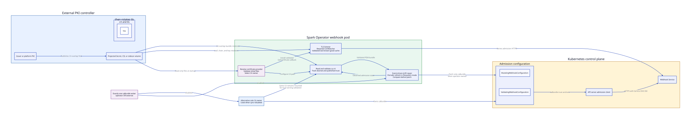
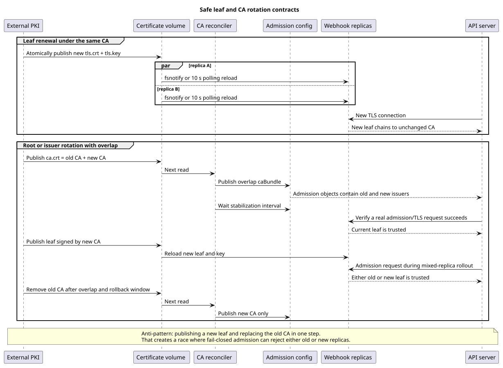

# KEP-3165: Filesystem-sourced TLS certificates for the webhook

**Authors:**
- Shubham Mishra - [@shubhM13](https://github.com/shubhM13)

**Tracking Issue:** [kubeflow/spark-operator#3165](https://github.com/kubeflow/spark-operator/issues/3165)

**Status:** Provisional

---

## Table of Contents

- [Summary](#summary)
- [Motivation](#motivation)
  - [Goals](#goals)
  - [Non-Goals](#non-goals)
- [Proposal](#proposal)
  - [User Stories](#user-stories)
  - [Ownership Model](#ownership-model)
  - [Risks and Mitigations](#risks-and-mitigations)
  - [Open Questions](#open-questions)
- [Design Details](#design-details)
  - [Configuration](#configuration)
  - [Helm and Kustomize](#helm-and-kustomize)
  - [Startup and Serving-Certificate Reload](#startup-and-serving-certificate-reload)
  - [CA Bundle Reconciliation](#ca-bundle-reconciliation)
  - [Rotation and Migration](#rotation-and-migration)
  - [Readiness](#readiness)
  - [RBAC](#rbac)
  - [Observability](#observability)
  - [Test Plan](#test-plan)
  - [Graduation Criteria](#graduation-criteria)
- [Implementation History](#implementation-history)
- [Drawbacks](#drawbacks)
- [Alternatives](#alternatives)

## Summary

The Spark Operator webhook currently obtains its TLS material in one of two
ways: it generates a self-signed CA and serving certificate, or it reads a
Secret populated by cert-manager. Both paths assume that the serving private key
is stored in a Kubernetes Secret and copied into the webhook's serving
directory.

Many production clusters instead use an external PKI agent, CSI driver,
projected Secret, or sidecar to deliver and rotate short-lived certificates as
files. This KEP adds an opt-in `filesystem` certificate provider that consumes
those files without creating, reading, updating, or copying a certificate
Secret.

The provider validates and hot-reloads the serving identity. CA publication is
a separate responsibility: the Spark Operator can synchronize the mounted CA
bundle into the mutating and validating webhook configurations, or an external
injector or declarative deployment system can be the sole `caBundle` owner.

Existing self-signed and cert-manager installations remain unchanged by
default.



## Motivation

An external PKI already owns certificate issuance, private-key rotation, and
renewal. Requiring that material to pass through the current self-signed or
cert-manager paths creates one or more of the following problems:

- A second component becomes responsible for a private key.
- The webhook retains Secret permissions it does not need.
- Certificate files are copied only at startup and do not follow renewal.
- A pod restart is required to serve a renewed certificate.
- Each external-PKI installation maintains a security-sensitive downstream
  patch.

Admission webhooks are fail-closed by default. A serving-certificate or CA
rotation mistake can therefore prevent unrelated Kubernetes API operations.
The upstream contract needs to define ownership, validation, overlap, and
rollback rather than merely adding a flag that skips certificate generation.

Related work:

- [#1178](https://github.com/kubeflow/spark-operator/issues/1178) requested
  cert-manager support.
- [#2373](https://github.com/kubeflow/spark-operator/pull/2373) implemented the
  current cert-manager path.
- [#2502](https://github.com/kubeflow/spark-operator/issues/2502) tracks future
  webhook deprecation. Existing supported releases still require safe TLS
  operation until that work is complete.

### Goals

- Add an explicit, opt-in filesystem certificate provider.
- Preserve the existing self-signed default and cert-manager compatibility.
- Never access a certificate Secret in filesystem mode.
- Validate the initial and replacement serving identity before accepting it.
- Reload valid certificate renewals without restarting the pod.
- Support one or more CA certificates for issuer overlap.
- Give exactly one component ownership of admission `caBundle` fields.
- Repair operator-owned CA drift after file or Kubernetes object changes.
- Render provider-specific probes and least-privilege RBAC.
- Define safe upgrade, root rotation, and rollback procedures.

### Non-Goals

- Issuing certificates or generating private keys for external PKI.
- Integrating directly with Vault, SPIRE, a particular CSI driver, or a service
  mesh.
- Building a second Spark-Operator-specific filesystem notification library.
- Fixing all cert-manager renewal behavior in this change.
- Managing CRD conversion-webhook CA bundles.
- Changing admission failure policies, selectors, ports, or handlers.
- Changing the default certificate provider.
- Guaranteeing atomicity across filesystems, Kubernetes objects, API servers,
  and webhook replicas.

## Proposal

Add `filesystem` alongside the current self-signed and cert-manager certificate
sources. The filesystem provider reads a serving certificate chain, private key,
and minimal CA bundle from configurable paths. It does not persist or copy the
external private key.

Certificate source and CA publication are selected independently:

- **Operator-owned CA publication:** the existing admission-configuration
  controllers publish the validated CA bundle.
- **External CA publication:** the Spark Operator does not read or write the
  admission configurations for certificate management. An injector, Helm,
  GitOps controller, or administrator owns the fields.

Exactly one CA writer is allowed. The binary and chart reject combinations that
would create two writers.

### User Stories

#### Story 1: platform PKI with operator-owned CA publication

A platform team mounts `tls.crt`, `tls.key`, and `ca.crt` into the webhook pod.
The webhook waits for a valid initial generation, serves it, follows renewals,
and publishes `ca.crt` into both admission configurations.

#### Story 2: existing CA injector

A cluster already uses a CA injector or GitOps controller. The platform team
mounts the same serving and CA files but disables Spark Operator CA
synchronization. The external system remains the only admission `caBundle`
writer.

#### Story 3: existing installation

An operator upgrades without selecting the new provider. Self-signed and
cert-manager behavior, resource names, command-line arguments, and rendered
manifests remain unchanged.

### Ownership Model

The following matrix is normative:

| Provider | CA sync | Serving identity owner | Certificate Secret access | `caBundle` owner |
|---|---|---|---|---|
| `self-signed` | `auto` or `enabled` | Spark Operator | Create, get, update | Spark Operator |
| `self-signed` | `disabled` | Spark Operator | Create, get, update | External system |
| `cert-manager` | `auto` | cert-manager | Get | cert-manager cainjector |
| `cert-manager` | `enabled` | Invalid initial combination | - | - |
| `cert-manager` | `disabled` | cert-manager | Get | External system |
| `filesystem` | `auto` or `enabled` | External PKI | None | Spark Operator |
| `filesystem` | `disabled` | External PKI | None | External system |

`auto` is deterministic. It never infers ownership from installed CRDs,
annotations, file presence, or field managers:

- self-signed: Spark Operator owns `caBundle`;
- cert-manager: cert-manager cainjector owns `caBundle`;
- filesystem: Spark Operator owns `caBundle`.

`self-signed + disabled` is retained to support staged ownership transfer.
`cert-manager + enabled` is initially invalid because the current provider does
not expose a dynamic CA source independent of cainjector.

### Risks and Mitigations

| Risk | Mitigation |
|---|---|
| A partial or invalid serving generation causes an outage | Validate before cache replacement and retain the last accepted pair |
| A new issuer is served before the API server trusts it | Publish an old-plus-new overlap bundle before accepting the new leaf |
| Two reconcilers fight over `caBundle` | Resolve one explicit owner and reject conflicting chart values or annotations |
| Filesystem notifications are unavailable or miss projected-volume changes | Keep bounded periodic polling independent of notification watch success |
| Followers compare against stale CA state | Refresh desired trust on every replica; only the leader writes Kubernetes objects |
| CA polling creates API churn | Compare before patching and perform zero writes after convergence |
| The webhook identity is accidentally reused by secure metrics | Use separate TLS option slices and install the certificate callback only on the webhook server |
| Broad enterprise trust permits webhook impersonation | Require a dedicated minimal CA bundle and report certificate count and digest |
| Upgrade or rollback reintroduces an old CA writer | Use a compatibility release and retain overlap until the rollback window closes |

### Open Questions

#### Question 1: controller-runtime watcher dependency

The controller-runtime watcher used by the current webhook server parses a
matching key pair but does not validate SAN, validity, usage, or issuer before
replacing its cache. It also compares only the leaf and key when detecting
changes, and its polling fallback does not start if filesystem watch
registration fails.

Options:

| Option | Trade-off |
|---|---|
| Enhance controller-runtime and consume the released version | Keeps certificate watching in the shared library, but introduces an upstream dependency and release wait |
| Add a bounded poll-based loader in Spark Operator | Unblocks implementation, but creates local TLS reload code to maintain |
| Accept controller-runtime's current validation | Smaller change, but a parseable wrong-SAN, expired, or wrong-issuer renewal can replace the working identity |

**Recommendation:** enhance controller-runtime. If that cannot be completed in
the implementation window, use a small poll-based loader only with explicit
maintainer approval and the same validation contract.

#### Question 2: initial chart surface for external CA ownership

Options:

| Option | Trade-off |
|---|---|
| Generic admission-configuration annotations | Supports existing injectors without depending on one product |
| Static CA PEM in Helm values | Simple for stable roots, but every rotation requires a chart release |
| Require out-of-band ownership | Smallest chart API, but initial installation is harder to make safe |

**Recommendation:** support generic annotations and optional static PEM. They are
mutually exclusive, and both remain disabled by default.

## Design Details

### Configuration

The binary adds these flags:

| Flag | Default | Description |
|---|---|---|
| `--webhook-cert-provider` | `self-signed` | `self-signed`, `cert-manager`, or `filesystem` |
| `--webhook-cert-dir` | Existing default | Serving-certificate directory |
| `--webhook-cert-name` | Existing `tls.crt` | Certificate-chain filename |
| `--webhook-key-name` | Existing `tls.key` | Private-key filename |
| `--webhook-ca-bundle-file` | Empty | Filesystem CA path; defaults to `<cert-dir>/ca.crt` in filesystem mode |
| `--webhook-ca-bundle-sync` | `auto` | `auto`, `enabled`, or `disabled` |
| `--webhook-ca-bundle-sync-interval` | `10s` | Successful filesystem refresh interval |
| `--webhook-ca-bundle-stabilization-interval` | `20s` | Time both admission objects must match before new trust authorizes a replacement leaf |
| `--webhook-cert-wait-timeout` | `2m` | Maximum initial wait for filesystem material |
| `--enable-cert-manager` | Existing `false` | Compatibility alias |

The command uses Cobra's `Flag.Changed` state to distinguish an omitted provider
from an explicitly selected value:

| Provider flag | Legacy cert-manager flag | Result |
|---|---|---|
| Omitted | false or omitted | `self-signed` |
| Omitted | true | `cert-manager` |
| `self-signed` | false or omitted | `self-signed` |
| `cert-manager` | either value | `cert-manager`; warn when both select it |
| `filesystem` | false or omitted | `filesystem` |
| `self-signed` or `filesystem` | true | Reject the conflict |

Unknown providers, unknown sync modes, non-positive intervals, and a
stabilization interval shorter than the sync interval fail before API mutation.

### Helm and Kustomize

The chart adds the following values under `webhook`:

```yaml
certificate:
  # Empty preserves certManager.enable compatibility.
  provider: ""
  certDir: ""
  certName: ""
  keyName: ""
  waitTimeout: 2m
  caBundle:
    file: ""
    sync: auto
    syncInterval: 10s
    stabilizationInterval: 20s
    # Used only when sync is disabled and Helm owns the field.
    pem: ""

# Used only when sync is disabled and an injector owns the field.
admissionConfigurationAnnotations: {}
```

A shared template helper resolves the provider once. Certificate resources,
Deployment arguments, cainjector annotations, and RBAC all use the resolved
value.

Filesystem mode uses the existing generic `webhook.volumes` and
`webhook.volumeMounts` extension points. It rejects the chart's default writable
`emptyDir` and `subPath` mount because those would either contain no external
material or prevent projected Secret updates. The documentation provides a
read-only whole-directory example.

The Deployment omits `--webhook-secret-name` and
`--webhook-secret-namespace` in filesystem mode. It also adds a startup probe
whose budget, and the Deployment progress deadline, exceed the configured file
wait timeout.

The proposal adds two Kustomize overlays so ownership-specific RBAC and
readiness are explicit:

- `webhook-filesystem-operator-ca`
- `webhook-filesystem-external-ca`

### Startup and Serving-Certificate Reload

Filesystem delivery may be asynchronous. Startup retries transient file absence,
permission errors, partial writes, and key mismatch until the bounded timeout.
It exits immediately on context cancellation.

One complete generation must pass all of these checks:

- Certificate and key parse through `tls.X509KeyPair`.
- The first certificate matches the private key.
- The leaf is currently valid.
- The leaf includes the exact webhook Service DNS SAN.
- Server authentication is allowed when extended usages are present.
- The leaf chain validates against the mounted CA bundle.

Certificate and CA files are limited to 1 MiB and 100 certificates. The key file
is limited to 1 MiB. Errors identify the path and validation category but never
include PEM or private-key contents.

The serving chain is leaf first, followed by intermediates. A projected-volume
symlink switch may occur between two file reads; a mixed pair is rejected and
retried while the previous accepted pair remains served.

The reload component validates a candidate before replacing its cache. A
replacement in operator-owned mode validates against **published trust**: the
last desired CA bundle observed in both admission configurations for the
stabilization interval. This prevents accepting a new issuer before trust has
converged. In external-owned mode, where admission read permissions are absent,
the candidate validates against the last valid mounted CA and the external owner
is responsible for publishing the same trust safely.

The command constructs independently owned webhook and metrics TLS option
slices from their common protocol policy. The reload component's
`GetCertificate` callback is installed only on the webhook server. The secure
metrics listener retains its existing certificate-selection behavior.

### CA Bundle Reconciliation

CA parsing and publication use a candidate/commit contract:

1. Read and parse a candidate without changing the last-known-good value.
2. Require one or more PEM `CERTIFICATE` blocks and reject private keys, unknown
   block types, trailing data, malformed DER, and non-CA certificates.
3. Canonically encode certificates while preserving input order and removing
   exact duplicates.
4. Verify that the candidate still validates the currently served leaf.
5. Commit the candidate as desired trust only after validation succeeds.

Every webhook replica refreshes desired trust for local serving validation and
readiness. A successful change immediately enqueues both fixed admission object
names. Only the leader-elected reconcilers publish it.

Each reconciler:

1. Reads committed desired trust.
2. Gets its named mutating or validating webhook configuration.
3. Compares every webhook entry's current `caBundle` with desired trust.
4. Returns without writing when all entries match.
5. Applies a targeted strategic merge patch keyed by webhook name when they do
   not match.
6. Schedules a jittered periodic safety reconciliation.

Kubernetes object watches remain for prompt drift repair. File refresh is
periodic because file changes do not emit Kubernetes events. Invalid file input
retains the last-known-good desired and API state and retries after the bounded
interval rather than entering unbounded workqueue backoff.

After both managed admission configurations continuously match desired trust for
the stabilization interval, the per-replica tracker advances published trust.
Readiness and replacement-leaf validation continue using the previous published
trust while a newer desired bundle converges.

### Rotation and Migration

Leaf renewal under an unchanged issuer is safe when the external owner publishes
the new certificate and key as one generation. Replicas may briefly serve old
and new leaves because both chain to already published trust.

Issuer rotation requires overlap:

1. Publish a CA file containing old and new trust anchors.
2. Wait until both admission configurations contain that bundle.
3. Wait for the stabilization interval and verify admission TLS.
4. Publish the new serving certificate and key.
5. Wait until all replicas serve the new identity.
6. Preserve overlap through the rollback window.
7. Remove the old CA and verify admission again.



There is no portable transaction across filesystem generations, two Kubernetes
objects, all API servers, and all replicas. Simultaneously replacing the old CA
and leaf is unsupported.

Migration from an older release uses a compatibility release that understands
the new provider and `sync=disabled`:

1. Deploy the compatibility release with the existing provider and owner.
2. Wait until no older replica remains.
3. Disable in-process CA sync while retaining the old leaf.
4. Start one persistent external CA owner and publish old-plus-new overlap.
5. Roll to filesystem serving while retaining overlap.
6. If operator ownership is desired, stop the external writer while retaining
   its last-applied field, then enable the operator reconciler with the same
   overlap.
7. Remove old trust only after the rollback window closes.

Rollback targets the compatibility release, not a legacy binary that would
restart self-minting and overwrite prepared trust.

### Readiness

The current server-started check does not prove that the API server trusts the
webhook. For explicitly selected filesystem mode with operator-owned CA sync,
readiness remains false until both admission configurations contain the
validated bootstrap CA.

After initial convergence, readiness uses published trust rather than newly read
desired trust. This keeps endpoints ready while overlap is being published or a
projected replacement is temporarily partial.

This is a local object-convergence signal, not proof that every API server has
consumed the latest object. The rotation procedure still requires a
stabilization interval and a real admission/TLS check before leaf cutover.

External-owned mode does not inspect admission objects because doing so would
require permissions solely to monitor another owner's responsibility.

### RBAC

Permissions are rendered from resolved responsibilities:

| Responsibility | Permission |
|---|---|
| Self-signed material | Create Secrets; get and update the named Secret |
| Current cert-manager provider | Get the named Secret |
| Filesystem provider | No certificate Secret permission |
| Operator CA publication | List/watch with exact-name field selectors; get and patch the named admission objects |
| External CA publication | No admission read or write permission for certificate management |

The existing reconcilers use full `update`. Migration to targeted `patch` uses a
two-release RBAC sequence: a compatibility release grants `update` and `patch`,
then the following release removes `update`.

Operator-owned CA publication requires leader election when the chart renders
more than one webhook replica. The chart rejects multiple replicas with resolved
operator ownership and leader election disabled.

### Observability

Startup logs the resolved provider and CA owner. Rotation logs include only a
short certificate or CA digest, certificate count, validity metadata, and target
resource. PEM and private-key contents are never logged.

Proposed fixed-cardinality metrics:

- serving-certificate expiry time, labeled by provider;
- CA refresh success timestamp;
- CA synchronization errors, labeled by resource kind and error category;
- CA update count, labeled by resource kind;
- CA in-sync state, labeled by resource kind.

Serial numbers, paths, full digests, Secret names, and raw error strings are not
metric labels.

### Test Plan

[x] I understand the owners of the involved components may require updates to
existing tests before implementation.

#### Prerequisite testing updates

- Add focused tests for both admission reconcilers.
- Fix and test validating-reconciler error propagation.
- Prove converged reconciliation performs no API write.
- Record default Helm and Kustomize output as the compatibility baseline.

#### Unit tests

The implementation touches currently tested packages, but coverage must be
measured and recorded in this section when implementation starts.

| Area | Required cases |
|---|---|
| Configuration | Defaults, legacy alias, every provider and owner, conflict and duration validation |
| File preflight | Delayed and partial files, key mismatch, validity, SAN, usage, issuer, chain ordering, size limits, cancellation |
| Reload | Last-known-good retention, projected symlink switch, full-chain-only change, watch failure with polling fallback |
| TLS isolation | Secure metrics never serves or follows the filesystem webhook identity |
| CA source | Candidate/commit ordering, canonicalization, overlap, invalid candidate retention, bounded retry |
| Reconcilers | Initial enqueue, drift, no-op, targeted patch, API errors, deletion and recreation |
| Readiness | Bootstrap convergence, follower readiness, overlap publication, external ownership |

#### Integration tests

- Start managers against envtest with pre-created admission configurations and
  delayed filesystem material.
- Rotate and corrupt CA input, proving update, retention, and automatic recovery.
- Run two managers with leader election, proving one writer and two ready serving
  replicas.
- Verify resource versions stop changing after convergence.
- Render all Helm provider/owner combinations and both Kustomize overlays,
  checking arguments, probes, annotations, CA encoding, mounts, and RBAC.

#### E2E tests

- Install with externally mounted test certificates through Helm and Kustomize.
- Exercise a real mutating and validating admission request.
- Renew the leaf without pod restart or admission failure.
- Publish old-plus-new CA overlap, change issuer, then remove old trust without
  admission failure.
- Skew rotation across two replicas.
- Inject missing, partial, malformed, expired, wrong-SAN, and wrong-issuer
  replacements and prove last-known-good behavior.
- Test upgrade and rollback through the compatibility release.

The required CI modes are `default`, `filesystem-operator-ca`, and
`filesystem-external-ca`. Duplicate Kubernetes-version combinations may be
reduced to keep CI cost bounded.

### Graduation Criteria

#### Alpha

- Provider and ownership APIs are accepted.
- Unit, integration, Helm, and Kustomize tests pass.
- Default behavior and rendered manifests are unchanged.
- At least one E2E leaf renewal and issuer-overlap transition pass.

#### Beta

- Multi-replica skew and rollback tests run in CI.
- At least two external certificate delivery mechanisms have experience reports.
- Observability names and labels are stable.
- No unresolved high-severity security or availability defects remain.

#### Stable

- The feature has shipped for two minor releases without API changes.
- Default and opt-in E2E paths remain supported in CI.
- Maintainers confirm the feature remains useful relative to the webhook
  deprecation plan.

## Implementation History

- **2026-09-13** - Tracking issue
  [#3165](https://github.com/kubeflow/spark-operator/issues/3165) opened and KEP
  drafted.

## Drawbacks

This adds flags, chart values, reconciliation, tests, and operational guidance to
a webhook that may eventually be deprecated. It also adds bounded file polling
and provider-specific RBAC branches.

The design cannot make root rotation globally atomic. It depends on an overlap
procedure and on external file writers publishing complete generations. External
CA ownership also means the Spark Operator cannot prove that mounted trust and
admission trust are identical without violating least privilege.

Finally, strict validation can reject certificate generations that an existing
downstream patch might have attempted to serve. That is intentional for a
fail-closed admission endpoint, but it requires clear diagnostics.

## Alternatives

### Require a pre-created Kubernetes Secret

This reuses part of the existing path but excludes PKI systems that write only
files, adds API persistence for private keys, and still requires correct live
reload behavior. Users remain free to project a Secret as filesystem input, but
it is not required by the provider.

### Reuse `--enable-cert-manager`

Filesystem PKI is not cert-manager. Reusing the boolean would render
cert-manager-specific resources and annotations, retain Secret access, and make
source and field ownership ambiguous.

### Add an `externally-managed` boolean

A boolean can skip generation but cannot describe whether files or a Secret are
the source or who owns `caBundle`. An enum plus a separate owner selection is
more explicit and extensible.

### Always use an external CA injector

This gives the Spark Operator less RBAC but makes a generic filesystem provider
depend on a separate privileged component that is not installed in every
cluster. External ownership remains supported rather than required.

### Always let the Spark Operator publish CA trust

This is turnkey but creates dual ownership in clusters with an existing
injector or GitOps manager. Explicit disablement is required for safe adoption.

### Copy files with an init container and restart for renewal

This snapshots the initial generation, duplicates private-key material, expands
the image trust boundary, and turns routine renewal into a disruptive rollout.

### Maintain a downstream-only patch

That avoids upstream API surface but makes each external-PKI operator maintain
the same security-sensitive behavior and migration logic. The requirement is
generic enough to support upstream.

### Wait for webhook deprecation

The completion and release timeline for removing webhook functionality is not
defined. Existing supported deployments still need safe certificate ownership
and rotation during that period.
